# Женский силуэт за неделю

Семь дней по 45–60 минут. В воскресенье ты строишь стоящую женскую фигуру за 20 минут так, что силуэт читается целиком.

<!--
Гайд рассчитан на карандаш и бумагу, без предварительной подготовки материалов.
-->

---
layout: default
---

# Как этим пользоваться

- **Материалы:** карандаш HB или B, пачка А4, таймер на телефоне. Больше ничего не нужно.
- **Один день — один подшаг.** Не забегай вперёд: день 4 не работает без дня 3.
- **Всегда по таймеру.** Закончилось время — лист в сторону, даже если не дорисовал.
- **Листы не выбрасывай.** В воскресенье будешь сравнивать с понедельником.
- **Критерий не сошёлся — повтори день.** Это не задержка, это и есть работа.

<Tip source="Джош Кауфман, «Первые 20 часов»">
Убери барьеры перед практикой. Карандаш и бумага должны лежать там, где ты садишься рисовать, иначе день пропускается не из-за лени, а из-за поиска ластика.
</Tip>

---
layout: default
---

# Карта роста

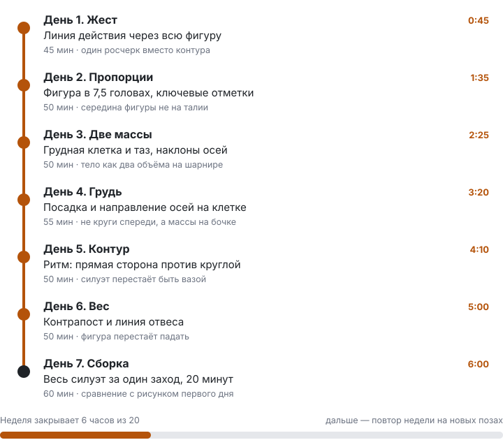

Шесть часов за неделю — это первая треть двадцатичасовой дистанции. Вторая и третья неделя повторяют ту же схему на новых позах и ракурсах.

---
layout: default
---

# Из чего состоит силуэт

Рисовать «женскую фигуру» нельзя — это слишком крупная задача. Можно тренировать семь отдельных вещей:

1. **Движение** — одна линия действия держит всю фигуру
2. **Пропорции** — фигура укладывается в 7,5 голов
3. **Массы** — грудная клетка и таз как два объёма
4. **Посадка груди** — масса лежит на клетке, а не приклеена спереди
5. **Ритм контура** — стороны силуэта не зеркальны
6. **Вес** — фигура стоит, а не висит
7. **Сборка** — всё вместе за 20 минут

<Tip source="Джош Кауфман, «Первые 20 часов»">
Разбей навык на части и тренируй ту, что даёт больше всего результата. Первые три подшага дают больше половины сходства.
</Tip>

---
layout: default
---

# День 1. Движение

Рисунок начинается не с края фигуры, а с движения внутри неё. Линия действия — одна дуга от макушки до опорной стопы. Она проходит сквозь тело, а не по контуру.

Рисуй её всей рукой от плеча. Кисть на этом этапе не работает.

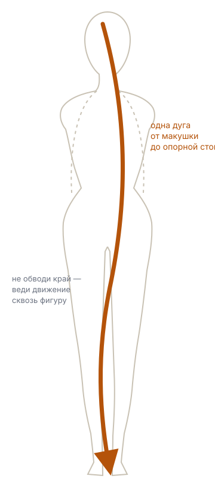

<!--
Если ученик начинает с плеч и груди — вернуть к дуге. Сначала движение, потом форма.
-->

---
layout: drill
minutes: 30
unit: сек
reps: 10
goal: 8 листов из 10 — одна непрерывная дуга через всю фигуру
---

# Дуга за 30 секунд

1. Поставь таймер на 30 секунд
2. Смотри на референс 5 секунд, дальше рисуй, глядя на него, а не на лист
3. Одна дуга от макушки к опорной стопе, карандаш не отрывается
4. Двумя короткими линиями отметь наклон плеч и наклон таза
5. Лист в сторону, следующий

**Обратная связь:** линия рвётся или ползёт по краю фигуры — значит ты обводишь контур, а не ведёшь движение.

::reference::

---
layout: drill
minutes: 5
reps: 2
goal: дуга проходит весь лист без остановки и без «мохнатых» повторных штрихов
---

# Рука от плеча

1. Возьми карандаш за дальний конец, ближе к торцу
2. Проведи 20 длинных дуг на весь лист
3. Локоть и кисть неподвижны, двигается только плечо
4. Каждая дуга — одно движение, без возврата

**Обратная связь:** если линия получается ворсистой, из коротких штрихов, ты рисуешь кистью. Отодвинь лист дальше и увеличь размах.

<!--
Это упражнение имеет смысл повторять как разминку перед каждым следующим днём.
-->

---
layout: default
---

# День 2. Пропорции

Взрослая женская фигура укладывается примерно в 7,5 голов. Главная отметка — середина фигуры: она приходится на лобковую кость, а не на талию. Почти все ошибки новичка растут отсюда.

Талия выше, чем кажется: около 2¾ головы. Бёдра по ширине равны плечам или чуть шире.

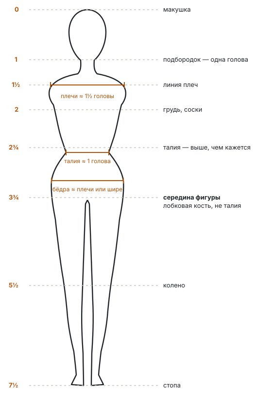

---
layout: drill
minutes: 10
reps: 2
goal: середина фигуры попадает в диапазон 3½–4 головы
---

# Линейка в головах

1. Проведи вертикаль на весь лист
2. Раздели её на 7,5 равных отрезков — это твоя линейка
3. Отметь: 1 подбородок, 1½ плечи, 2 грудь, 2¾ талия, 3¾ середина, 5½ колено
4. Посади фигуру на эти отметки, начиная с дуги движения

**Обратная связь:** измерь готовый рисунок карандашом на вытянутой руке — высота головы должна уложиться в фигуру 7–8 раз.

::reference::

---
layout: drill
minutes: 6
reps: 3
goal: отклонение середины от 3¾ головы не больше половины головы
---

# Проверка вслепую

1. Нарисуй фигуру целиком без разметки, как получится
2. Только после этого проведи линейку в головах поверх рисунка
3. Отметь, где ошибся, одним цветом или нажимом
4. Следующий лист — с учётом ошибки, снова без разметки

**Обратная связь:** ошибка почти всегда в одну и ту же сторону. Запомни свою: обычно это слишком длинный торс и короткие ноги.

---
layout: default
---

# День 3. Две массы

Выше колен тело — это два объёма на гибком соединении: грудная клетка как яйцо, сужённое кверху, и таз как коробка. Между ними мягкая талия.

Оси плеч и таза почти никогда не параллельны. Как только они параллельны, фигура читается доской.

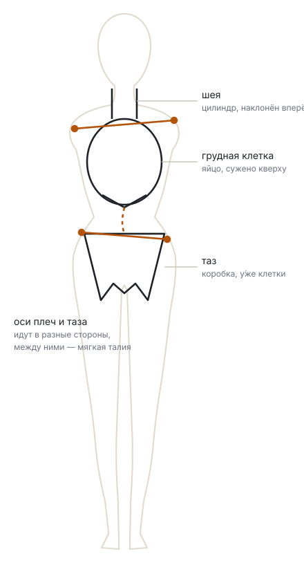

---
layout: drill
minutes: 5
reps: 6
goal: в 5 набросках из 6 оси плеч и таза непараллельны
---

# Яйцо и коробка

1. Только два объёма: яйцо клетки и коробка таза
2. Через каждый проведи ось — линию плеч и линию таза
3. Наклони оси в разные стороны
4. Соедини шеей-цилиндром, добавь дугу движения
5. Никакого контура, никаких деталей

**Обратная связь:** если набросок читается как доска, оси ушли в параллель.

::reference::

---
layout: drill
minutes: 6
reps: 3
goal: в каждом наброске видно, что клетка и таз развёрнуты по-разному
---

# Поворот

1. Нарисуй те же две массы, но клетку разверни вполоборота, а таз оставь фронтально
2. Покажи поворот сужением: дальняя сторона клетки у́же ближней
3. Повтори наоборот: таз в повороте, клетка фронтально

**Обратная связь:** если обе массы читаются одинаково фронтально, поворот не показан — вернись к сужению дальней стороны.

---
layout: default
---

# День 4. Посадка груди

Грудь — не деталь, приклеенная спереди. Это масса, лежащая на грудной клетке примерно между вторым и шестым ребром. Всё, что выше и ниже, — плоскость клетки.

Оси расходятся от грудины наружу и вниз, у грудины остаётся просвет. В профиль верхний скат почти прямой, нижний — полная дуга.

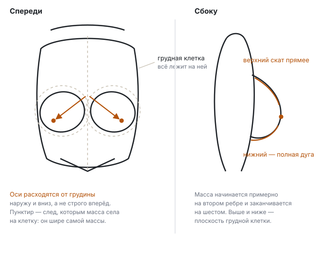

<!--
Порядок обязателен: сначала клетка, потом то, что на ней лежит. Обратный порядок даёт плоские круги.
-->

---
layout: drill
minutes: 8
reps: 3
goal: у грудины есть просвет, оси не параллельны, форма читается объёмом
---

# Посадка на клетку

1. Сначала грудная клетка целиком, как вчера
2. Отметь линию грудины по центру
3. Наметь след — овал, которым масса села на клетку. Он шире самой массы
4. Поверх следа построй саму форму
5. Поставь точку оси на каждой стороне

**Обратная связь:** закрой контур ладонью и посмотри только на построение. Если без контура читаются два круга, объёма нет.

::reference::

---
layout: drill
minutes: 6
reps: 3
goal: верхний скат прямее нижнего во всех трёх набросках
---

# Профиль

1. Нарисуй торс сбоку: клетка как бочка, а не как лист
2. Проведи линию, по которой масса прилегает к клетке — она идёт наклонно
3. Верхний скат — почти прямая линия
4. Нижний — полная дуга
5. Проверь, что масса не опускается ниже нижнего края рёбер

**Обратная связь:** одинаково круглые верх и низ дают шар, а не форму. Спрямляй верхний скат.

---
layout: compare
---

# Ошибка: грудь приклеена спереди

Возникает, когда рисуешь форму раньше, чем построил клетку.

::wrong::

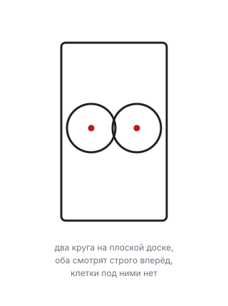

::right::

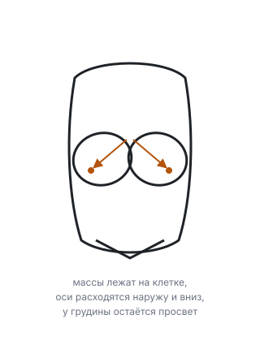

---
layout: default
---

# День 5. Ритм контура

Контур фигуры — не симметричный узор. На каждом уровне одна сторона спокойная: длинная, почти прямая линия. Противоположная в это же время активная: дуга. Ниже они меняются местами.

Это то, что отличает живой силуэт от вазы.

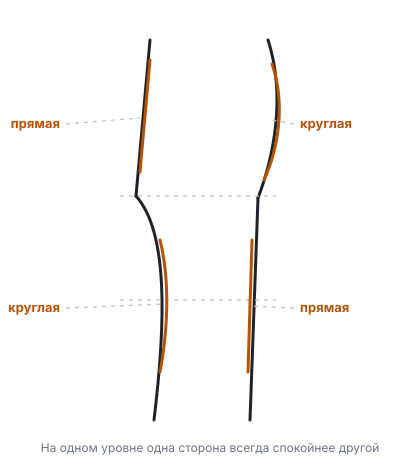

---
layout: drill
minutes: 6
reps: 4
goal: ни на одном уровне обе стороны не повторяют друг друга
---

# Прямая против круглой

1. Рисуй только контур торса, без внутренних линий
2. На каждом уровне сначала реши, какая сторона спокойная
3. Спокойную веди одной длинной линией, активную — дугой
4. Ниже поменяй их местами

**Обратная связь:** переверни лист вверх ногами. Зеркальность сторон становится видна мгновенно.

::reference::

---
layout: drill
minutes: 5
reps: 3
goal: фигура читается как женская по одному силуэту, без внутренних линий
---

# Силуэт заливкой

1. Нарисуй фигуру и залей её ровным тоном целиком
2. Внутри ничего не рисуй: ни груди, ни лица, ни складок
3. Смотри только на край
4. Отойди на три шага и посмотри

**Обратная связь:** если с трёх шагов фигура не читается, проблема в силуэте, а не в деталях. Детали её не спасут.

---
layout: compare
---

# Ошибка: силуэт-ваза

Возникает, когда обе стороны рисуются одной и той же кривой, отражённой зеркально.

::wrong::

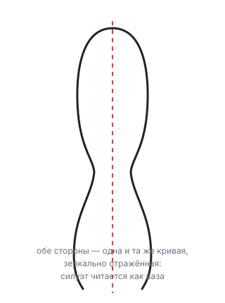

::right::

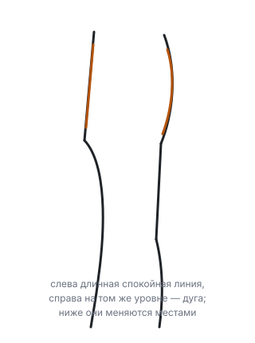

---
layout: default
---

# День 6. Вес

Стоящая фигура опирается на одну ногу. Со стороны опоры таз идёт вверх, а плечи в это время уходят вниз — оси расходятся. Опорная нога прямая, свободная согнута в колене.

Проверка одна: отвес от ямки между ключицами падает на опорную стопу.

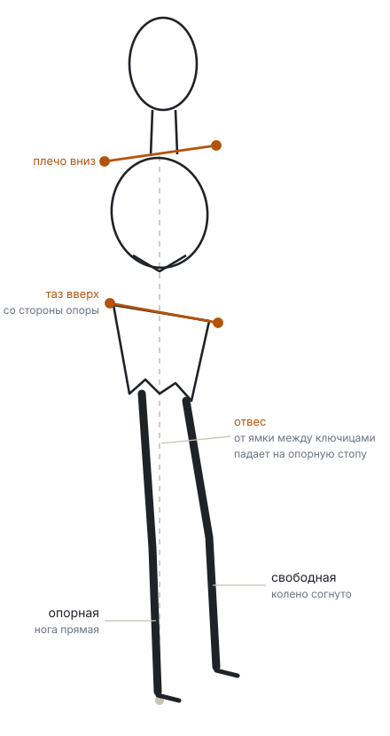

---
layout: drill
minutes: 7
reps: 3
goal: отвес попадает на опорную стопу 3 раза из 3
---

# Отвес

1. Построй фигуру массами, как в день 3
2. Реши, какая нога опорная, и подними таз с этой стороны
3. Проведи вертикаль от ямки между ключицами вниз
4. Она должна попасть на опорную стопу

**Обратная связь:** если отвес мимо, двигай таз и клетку, а не стопу. Стопа стоит там, где стоит, — фигура балансируется корпусом.

::reference::

---
layout: drill
minutes: 5
reps: 4
goal: в каждом наброске таз и плечи наклонены в противоположные стороны
---

# Смена опоры

1. Нарисуй позу с опорой на левую ногу
2. Рядом — ту же позу с опорой на правую
3. Следи, чтобы наклоны осей поменялись местами вместе с опорой
4. Повтори пару ещё раз, быстрее

**Обратная связь:** если при смене опоры рисунок не изменился, ты рисуешь заученную схему, а не вес.

---
layout: default
---

# День 7. Сборка

Сегодня ничего нового. Всё, что отрабатывал по частям, собирается в один проход по таймеру. Порядок стадий менять нельзя: каждая следующая опирается на предыдущую.

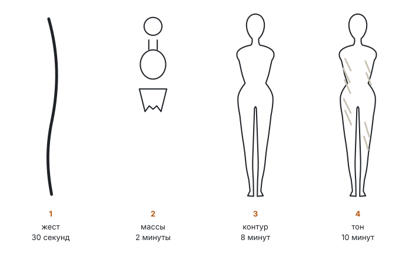

Если время на стадию вышло — переходи к следующей недоделанным. Это тренировка распределения времени, а не аккуратности.

---
layout: drill
minutes: 20
reps: 1
goal: все четыре стадии уложились в 20 минут и прошли по порядку
---

# Полный проход

1. **30 секунд** — дуга движения, наклоны плеч и таза
2. **2 минуты** — клетка, таз, шея, оси
3. **8 минут** — контур с ритмом, посадка груди, отвес
4. **10 минут** — тон: одна тень по всей теневой стороне, без деталей

**Обратная связь:** отойди на три шага. Силуэт должен читаться целиком, а взгляд — не спотыкаться об одно проработанное место посреди пустого рисунка.

---
layout: drill
minutes: 25
reps: 1
goal: пропорции копии совпадают с оригиналом в пределах половины головы
---

# Копия мастера

1. Возьми любой рисунок фигуры старого мастера
2. Строй его теми же четырьмя стадиями, не обводя контур
3. Сначала найди в чужом рисунке линию действия и оси — они там есть
4. Сверь пропорции измерением, а не на глаз

**Обратная связь:** наложи свою копию на оригинал мысленно по отметкам в головах. Расхождение больше половины головы — смотри, на какой стадии оно появилось.

<Tip source="Роберт Грин, «Мастерство»">
Ученичество идёт раньше собственного почерка. Копируя мастера, ты забираешь не картинку, а порядок его действий.
</Tip>

---
layout: checkpoint
---

# Чек-лист недели

- Середина фигуры приходится на лобковую кость, а не на талию
- Клетка и таз читаются как два объёма с разными наклонами осей
- Грудь лежит на клетке, у грудины есть просвет
- Стороны силуэта не зеркальны друг другу
- Отвес попадает на опорную стопу
- Полный рисунок укладывается в 20 минут

::fallback::

Каждый несошедшийся пункт — это конкретный день: пропорции — день 2, массы — день 3, грудь — день 4, контур — день 5, вес — день 6. Повтори этот день целиком, прежде чем идти на вторую неделю.

---
layout: default
---

# Что дальше

Положи рядом лист понедельника и лист воскресенья. Разница между ними — и есть результат шести часов.

- **Вторая неделя:** те же семь дней, но фигура в повороте и с опорой на другую ногу
- **Третья неделя:** руки и кисти, они держат позу не меньше корпуса
- **Каждый день:** пять минут дуг от плеча как разминка

<Tip source="Роберт Грин, «Мастерство»">
Иди туда, где не получается. День, который ты хочешь пропустить, обычно и есть тот, который даёт рост.
</Tip>

<!--
Лог практики: дата, минуты, что не получилось. Без лога не видно, какой день пропускается систематически.
-->
