# Грудь: посадка и форма

Академический разбор для рисунка с натуры. Два часа: клетка, посадка, форма, тон. 18+

<!--
Урок опирается на день 3 и день 4 первой недели. Без построенной клетки не работает.
-->

---
layout: default
---

# Для кого этот урок

Это рисунок обнажённой натуры в том виде, в каком он идёт в художественной школе: разбирается конструкция формы, а не внешность.

- **Нужен опыт:** урок 1, дни 3 и 4. Пока клетка не строится, строить на ней нечего.
- **Материалы:** карандаш HB или B, пачка А4, таймер.
- **Возраст:** 18+. В референсах обнажённая натура из музейных коллекций и анатомические таблицы.
- **Натура:** рисуй с живой натуры, гипса или музейных штудий. Схемы в уроке — построение, а не образец внешности.

---
layout: default
---

# Зачем этот урок

- **Результат:** строишь грудь в трёх ракурсах так, что форма сидит на клетке и читается объёмом
- **Проверяется так:** закрой ладонью контур. Если без контура форма читается — построение есть
- **Нужно для:** рисунка торса целиком, а дальше — фигуры в сложных позах

Главная мысль урока помещается в одну строку: это не деталь спереди, это масса, лежащая на грудной клетке.

<Tip source="Джош Кауфман, «Первые 20 часов»">
Тренируй тот подшаг, который даёт больше всего результата. Здесь это посадка на клетке: она чинит сразу и форму, и ракурс, и тон.
</Tip>

---
layout: default
---

# Из чего состоит задача

1. **Клетка** — объём, на котором всё лежит
2. **След посадки** — чем форма села на клетку и в каких границах
3. **Профиль формы** — верхний скат прямее, нижний полнее
4. **Ракурс** — поворот меняет видимую ширину, но не посадку
5. **Поза** — поднятая рука или наклон меняют саму форму
6. **Тон** — объём даётся одной большой тенью

Первые два пункта дают больше половины результата. Остальные четыре без них не работают.

---
layout: default
---

# Основа: всё лежит на клетке

Грудная клетка — бочка, сужённая кверху. Её передняя стенка гнутая: рёбра идут от грудины вбок и вниз. Ниже рёберной дуги груди нет.

Строй её первой. Пока клетки нет, форму некуда сажать.

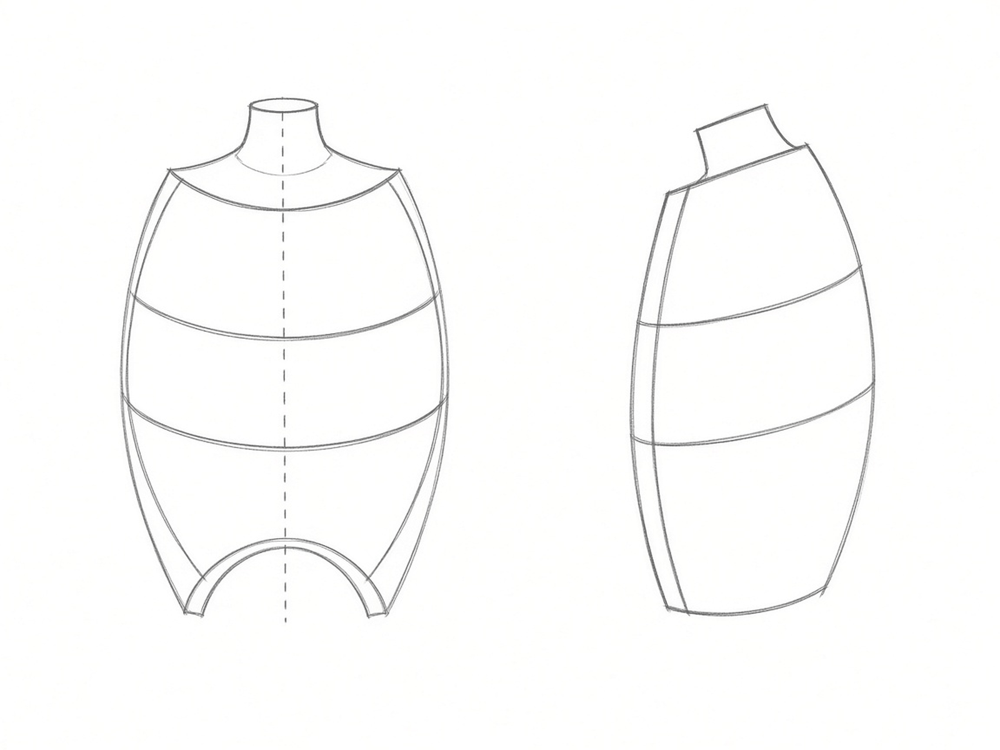

---
layout: default
---

# След посадки

Масса занимает на клетке область примерно от второго ребра до шестого, от грудины до передней подмышечной линии. Сначала рисуешь этот след, потом форму на нём.

След шире самой массы. Оси расходятся от грудины наружу и вниз, у грудины остаётся просвет.

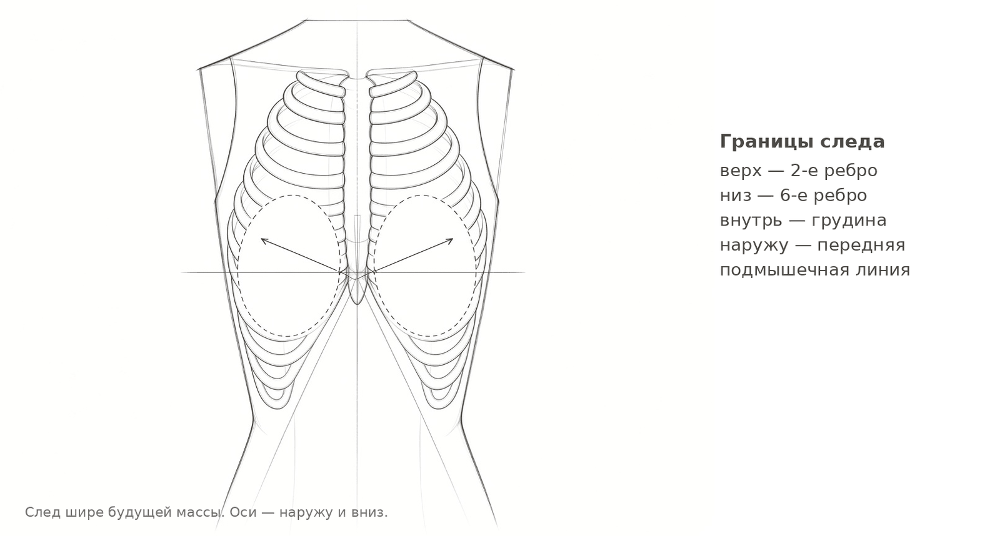

---
layout: default
---

# Форма в профиль

Верхний скат идёт почти прямой линией, иногда слегка вогнутой. Нижний — полная дуга, и самая полная точка ближе к низу. Сосок лежит на нижней трети и вынесен наружу.

Складка снизу — это место контакта с клеткой. Она даётся тоном, а не проведённой линией.

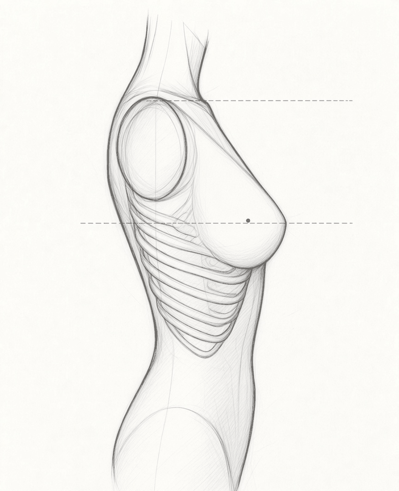

---
layout: default
---

# Три ракурса

Поворот корпуса меняет видимую ширину массы, но не её посадку. Верх, низ и высота соска остаются на тех же уровнях клетки.

В три четверти дальняя масса короче и частично уходит за силуэт. Это перспектива на округлой поверхности, а не «другая грудь».

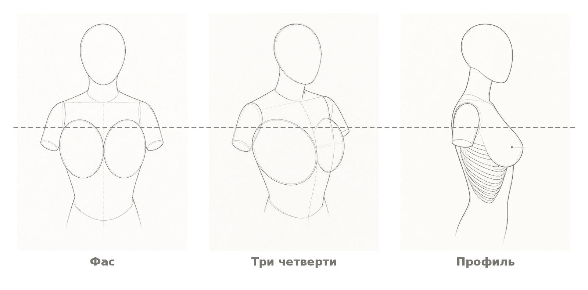

---
layout: default
---

# Разбор: порядок построения

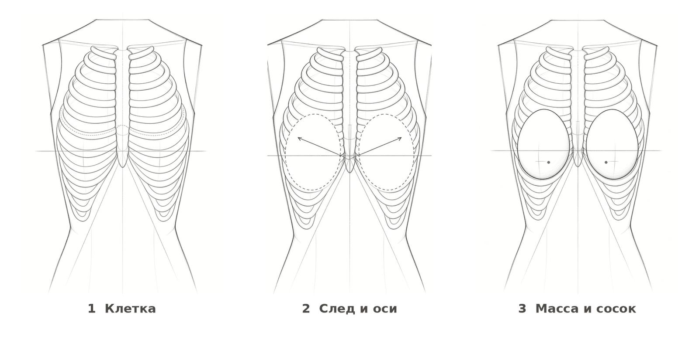

Порядок не переставляется. Начнёшь с третьего шага — получишь два круга, приклеенных к плоскости, и дальше никакой тон этого не исправит.

<!--
Самая частая просьба ученика — «давай сразу форму». Именно здесь и ломается результат.
-->

---
layout: drill
minutes: 8
reps: 3
goal: у грудины просвет, след шире массы, оси не параллельны
---

# След на клетке

1. Построй клетку: бочка, ключицы, рёберная дуга, вертикаль грудины
2. Отметь границы: второе ребро сверху, шестое снизу, подмышечная линия снаружи
3. Нарисуй два овала следа, наклонив их наружу и вниз
4. Поверх следа построй саму массу
5. Поставь соски на нижней трети, наружу от центра

**Обратная связь:** закрой ладонью контур массы. Посадка должна читаться сама, без внешней линии.

::reference::

---
layout: drill
minutes: 10
reps: 3
goal: во всех трёх ракурсах сосок остаётся на одной высоте
---

# Три ракурса

1. Нарисуй одну и ту же натуру в фас, три четверти и профиль
2. Сначала во всех трёх построй клетку и уровни: верх, низ, высота соска
3. Только потом строй массы
4. В три четверти укороти дальнюю массу и заведи её за силуэт

**Обратная связь:** проведи горизонталь через все три рисунка на высоте соска. Если уровни разъехались, ты рисовал три разные натуры.

::reference::

---
layout: compare
---

# Ошибка: два шара спереди

Возникает, когда форма строится раньше клетки.

::wrong::

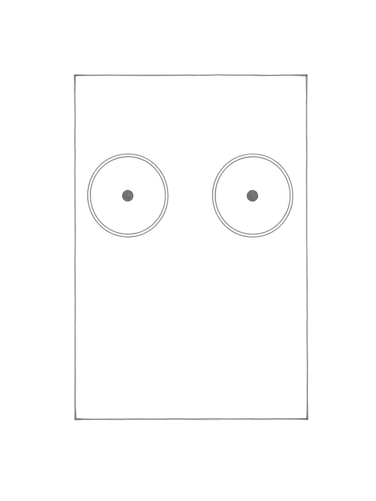

::right::

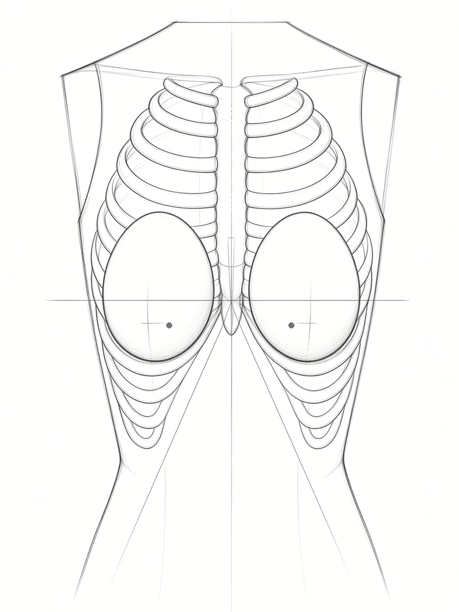

---
layout: default
---

# Поза меняет форму

Форма не постоянная. Опущенные руки — масса лежит на клетке, складка снизу выражена. Поднятые — масса уходит вверх и наружу, складка почти исчезает. Наклон вперёд — форма вытягивается вниз.

Рисуй то, что видишь в этой позе, а не заученную схему из прошлого рисунка.

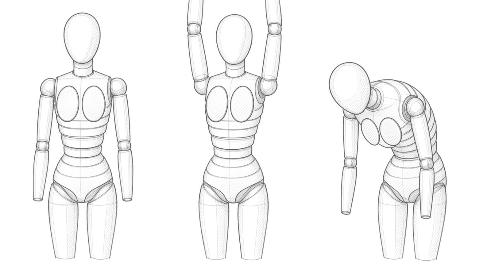

---
layout: drill
minutes: 8
reps: 3
goal: три рисунка отличаются формой, а не только положением рук
---

# Поза меняет форму

1. Первый лист: руки опущены
2. Второй: руки подняты над головой
3. Третий: корпус наклонён вперёд
4. Клетку во всех трёх строй одинаковую, меняй только то, что на ней лежит

**Обратная связь:** положи три листа рядом. Если формы можно поменять местами и ничего не изменится, поза не прочитана.

::reference::

---
layout: compare
---

# Ошибка: симметричные близнецы

Возникает, когда рисуется схема, а не натура: корпус развёрнут, а формы зеркальны.

::wrong::

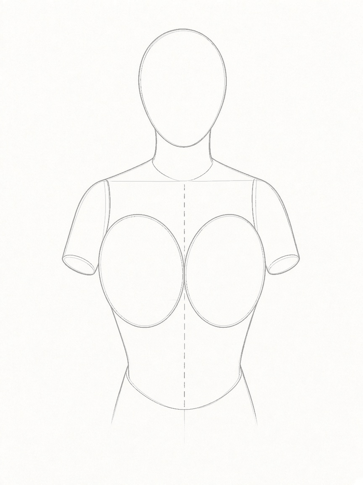

::right::

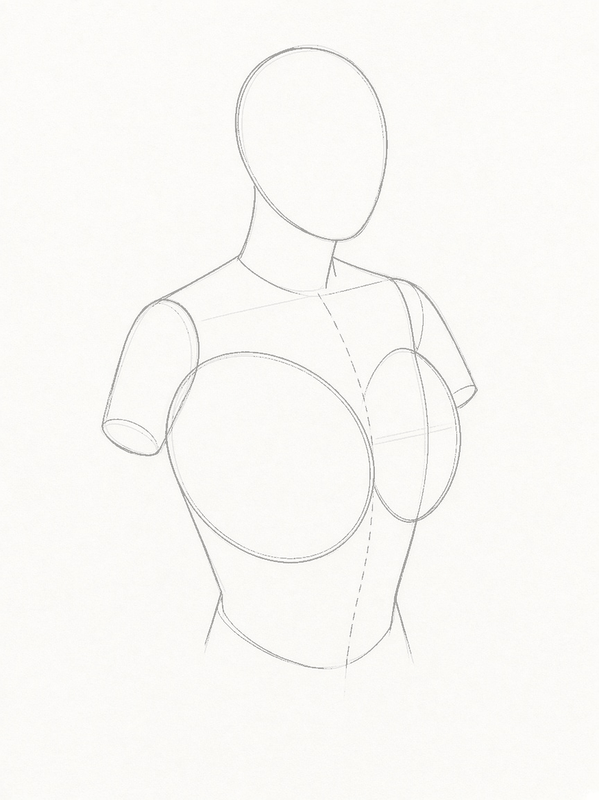

---
layout: default
---

# Тон: объём одной тенью

Объём даёт не контур, а тень. Одно большое пятно на теневой стороне массы, продолжающееся в тень под ней. Штрих кладётся поперёк формы, а не вдоль края.

Сосок не темнее самой тёмной части тени. Как только он становится чёрной точкой, объём рассыпается.

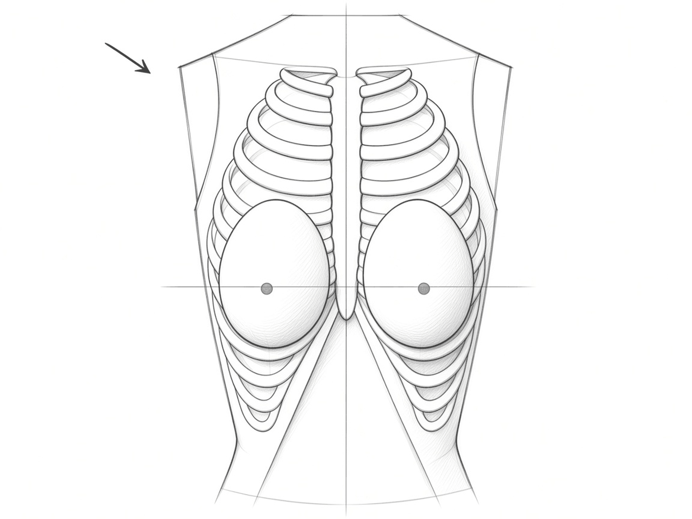

---
layout: drill
minutes: 10
reps: 2
goal: сосок не темнее самой тёмной части теневой стороны
---

# Тон одной тенью

1. Построй форму линией, как в первом дрилле
2. Определи, откуда свет, и отметь стрелкой на полях
3. Положи одну тень: теневая сторона и тень под массой одним пятном
4. Добавь рефлекс у нижнего края, светлее тени
5. Ничего больше не трогай

**Обратная связь:** прищурься и посмотри на рисунок. Должно остаться два пятна: свет и тень. Если видно больше трёх, ты ушёл в детали.

::reference::

---
layout: checkpoint
---

# Самопроверка

- Клетка построена раньше формы и читается как объём
- След посадки шире массы, у грудины есть просвет
- Оси расходятся от грудины наружу и вниз
- Верхний скат спокойнее нижнего
- Сосок ниже середины массы и смещён наружу
- В три четверти дальняя масса сокращена
- Сосок не самое тёмное место рисунка

::fallback::

Каждый несошедшийся пункт — это конкретный дрилл. Посадка — первый, ракурс — второй, поза — третий, тон — четвёртый. Повтори его, прежде чем идти дальше.

---
layout: default
---

# Практика дальше

- **15 минут в день × 5 дней** — один торс с натуры или с музейной штудии, по четырём шагам построения
- Раз в неделю — копия штудии старого мастера: ищи в ней посадку и оси, не обводи контур
- Веди лог: дата, минуты, какой пункт самопроверки не сошёлся

<Tip source="Роберт Грин, «Мастерство»">
Копируя мастера, ты забираешь не картинку, а порядок его действий. Смотри, с чего он начал, а не чем закончил.
</Tip>

---
layout: default
---

# Схемы и источники

Все схемы урока нарисованы для него же и лежат в `images/diagrams/` как карандашные PNG. Рядом с каждой лежит файл с описанием рисунка: что изображено, что обязано быть видно, чего быть не должно, и промпт для отрисовки.

Стиль иллюстраций задан в `templates/illustration-style.md`. Штрих по форме есть только на пластине `shading.png` — это единственная схема урока про тон.

Референсы в `images/ref/`: академическая штудия Etty (три четверти) и таблица pectoralis major из Gray's Anatomy. Профильной штудии старого мастера пока нет — лицензии не выдумываем. Полная таблица — в `images/attribution.md`.
