# Перспектива объёмов

Пять дней по 45–50 минут. В конце ты строишь коробку, цилиндр и шар на одном горизонте и собираешь из них торс в повороте.

<!--
Урок закрывает долг курса: уроки 01 и 02 уже требуют строить объёмы в повороте, но нигде этому не учили.
-->

---
layout: default
---

# Как этим пользоваться

Этот урок идёт сразу после первой недели, хотя по номеру он третий. Уроки 01 и 02 просят «яйцо клетки и коробку таза», поворот сужением дальней стороны и массу на бочке — то есть уже пользуются тем, чему учат здесь.

- **Материалы:** карандаш, пачка А4, таймер. Линейка не нужна, всё от руки.
- **Натура дня:** спичечный коробок, кружка, яйцо или мячик. Всё это уже есть дома, специально покупать нечего.
- **Горизонт первым.** На каждом листе линия горизонта проводится до всего остального.
- **Скрытые рёбра рисуются.** Сквозное построение: не видишь дальнее ребро — всё равно проведи его пунктиром, иначе объём не проверить.

<Tip source="Джош Кауфман, «Первые 20 часов»">
Убери барьеры перед практикой. Натура для этого урока — то, что лежит на столе; искать и ставить постановку не нужно.
</Tip>

---
layout: default
---

# Зачем этот урок

- **Результат:** строишь на одном горизонте коробку в двух точках, цилиндр с эллипсом на оси и шар с поперечными дугами, а потом собираешь из них торс в повороте
- **Проверяется так:** продли рёбра коробки — они собираются в две точки на твоём горизонте; закрой ладонью контур яйца — поворот всё равно понятен по дугам
- **Нужно для:** ракурсов в уроке 01, посадки массы на клетку в уроке 02 и всей дальнейшей фигуры

Поворот в рисунке показывает не смещение контура, а сужение дальней стороны и направление дуг. Пока это не построено, ракурс рисуется наугад.

---
layout: default
---

# Из чего состоит задача

1. **Горизонт** — это уровень твоих глаз, а не линия пейзажа
2. **Точки схода** — все параллельные рёбра собираются в одну точку на горизонте
3. **Коробка** — ближнее ребро длиннее, дальняя грань у́же, вертикали не завалены
4. **Эллипс** — малая ось лежит на оси цилиндра, и эллипс раскрывается по мере удаления от горизонта
5. **Поперечная дуга** — оборачивает форму и замыкается в эллипс
6. **Сборка** — оба объёма стоят на одном горизонте и смотрят в одну сторону

<Tip source="Джош Кауфман, «Первые 20 часов»">
Разбери навык на части и тренируй ту, что даёт больше всего результата. Здесь это коробка: цилиндр и шар строятся внутри неё.
</Tip>

---
layout: default
---

# День 1. Горизонт — это твои глаза

Линия горизонта на листе — уровень глаз, а не край земли. Предмет ниже глаз — видишь его верхнюю грань. Выше глаз — нижнюю. Ровно на уровне глаз — грань схлопывается в линию.

Поэтому горизонт проводится первым: он решает, что у предмета будет видно.

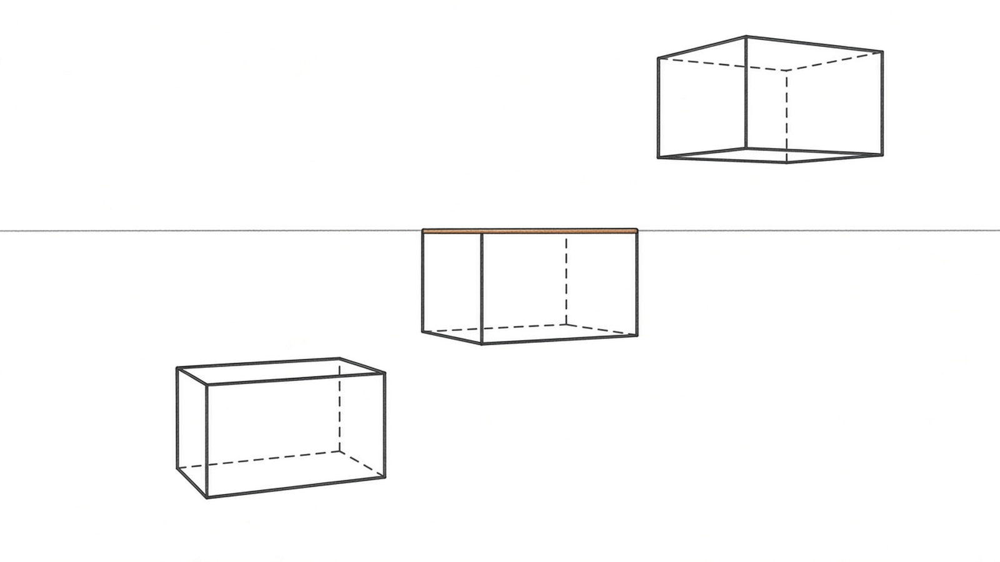

---
layout: drill
minutes: 3
reps: 6
goal: 6 из 6 — снизу видна верхняя грань, сверху нижняя, на уровне глаз грань стала линией
---

# Три уровня

1. Положи спичечный коробок на пол и нарисуй с натуры
2. Подними его ровно на уровень глаз, нарисуй снова
3. Подними выше головы, нарисуй третий раз
4. Пройди круг дважды, по два наброска на положение

**Обратная связь:** подвинь коробок так, чтобы верхняя грань встала точно на уровень глаз — она схлопнется в линию. Если на твоём среднем наброске нарисована крышка, ты рисовал знание, а не вид.

::reference::

---
layout: default
---

# День 1. Точки схода

Параллельные в жизни рёбра на листе сходятся в одну точку, и эта точка лежит на горизонте. Не «примерно к центру», а в одну конкретную точку, общую для всех рёбер одного направления.

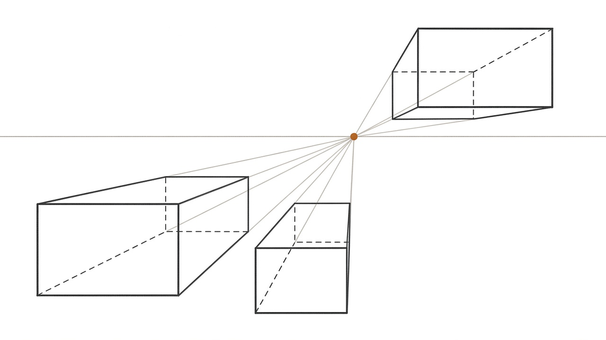

Проверяется линейкой или ровным краем листа: приложил к ребру — край обязан пройти через точку.

---
layout: drill
minutes: 6
reps: 3
goal: 3 из 3 листов — ни одно ребро не промахивается мимо точки больше чем на ширину карандаша
---

# Пучок в одну точку

1. Проведи горизонт и поставь на нём одну точку схода
2. Нарисуй пять фронтальных прямоугольников в разных местах листа
3. У каждого уведи глубину в эту точку
4. Ребра веди одним движением, не подправляй по частям

**Обратная связь:** приложи ровный край к каждому уходящему ребру и продли его. Край обязан пройти через точку схода.

::reference::

---
layout: default
---

# День 2. Коробка в двух точках

Две точки схода — по одной на каждое горизонтальное направление, обе на горизонте. Вертикали при этом остаются вертикальными: третьей точки в этом уроке нет.

Ближнее вертикальное ребро — самое длинное. Дальняя грань у́же ближней.

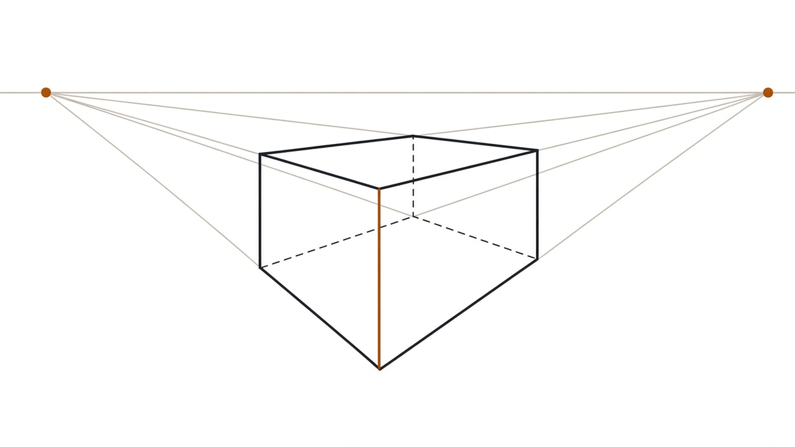

---
layout: drill
minutes: 7
reps: 3
goal: 3 из 3 — вертикали параллельны краю листа, ближнее ребро длиннее дальних, оба пучка сходятся каждый в свою точку
---

# Коробка в двух точках

1. Горизонт через весь лист, две точки схода у самых краёв
2. Ближнее вертикальное ребро — в центре листа
3. От его концов — четыре ребра в точки схода
4. Дальние вертикали, потом три скрытых ребра пунктиром

**Обратная связь:** продли все четыре ребра одного направления за коробку. Они обязаны собраться в одной точке на горизонте. Расходятся или пересекаются раньше — коробка разъехалась.

::reference::

<!--
Если точки не влезают на лист, отметить их на соседнем и класть листы рядом.
-->

---
layout: default
---

# День 2. Проверка диагоналями

Диагонали грани пересекаются в её перспективной середине. Это единственный способ проверить себя без линейки и без точек схода.

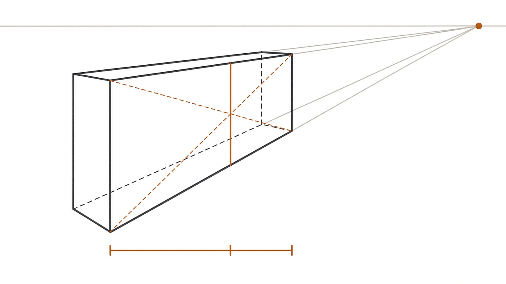

Дальняя половина грани обязана быть короче ближней. Равные половины означают, что нарисован прямоугольник, а не грань в перспективе.

---
layout: drill
minutes: 6
reps: 3
goal: 3 из 3 — на обеих видимых гранях дальняя половина короче ближней
---

# Проверка диагоналями

1. Возьми коробку из прошлого дрилла
2. На каждой видимой боковой грани проведи обе диагонали
3. Через их пересечение проведи среднюю линию грани
4. Повтори на трёх новых коробках

**Обратная связь:** отмерь карандашом ближнюю и дальнюю половины грани от средней линии. Дальняя обязана быть короче.

::reference::

---
layout: compare
---

# Ошибка: рёбра не сходятся

Возникает, когда рисуешь знание «грани коробки равны», а не то, что видишь.

::wrong::

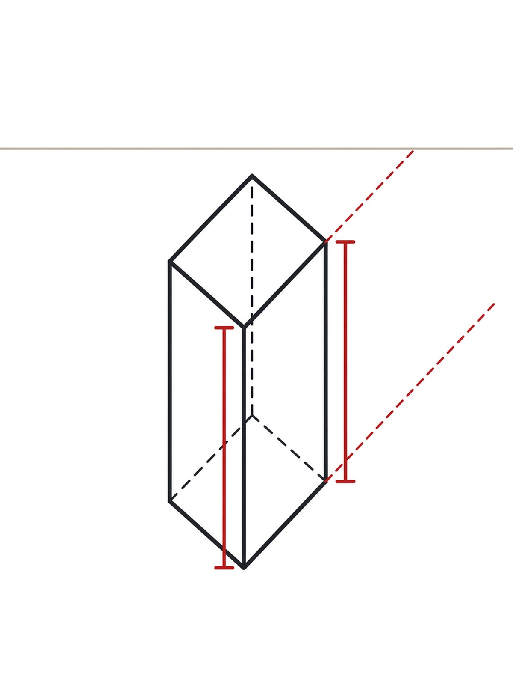

::right::

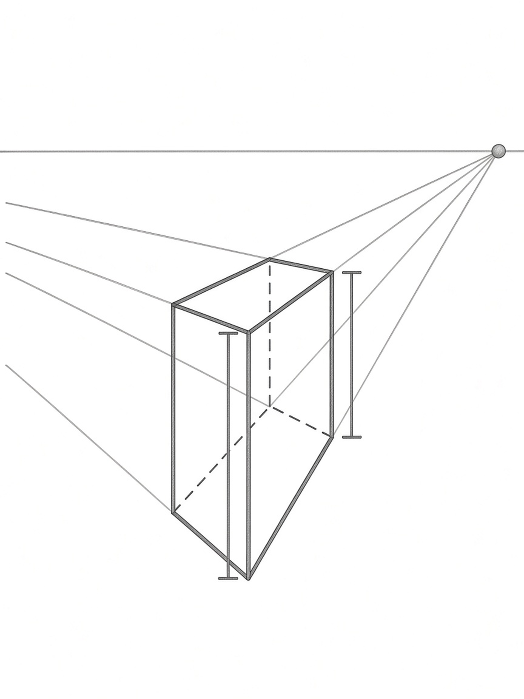

---
layout: default
---

# День 3. Эллипс лежит на оси

Круг в перспективе становится эллипсом. Главное правило одно: **малая ось эллипса лежит на оси цилиндра**, а большая идёт поперёк неё.

Порядок такой: сначала ось цилиндра, потом большая ось поперёк, и только потом сам эллипс.

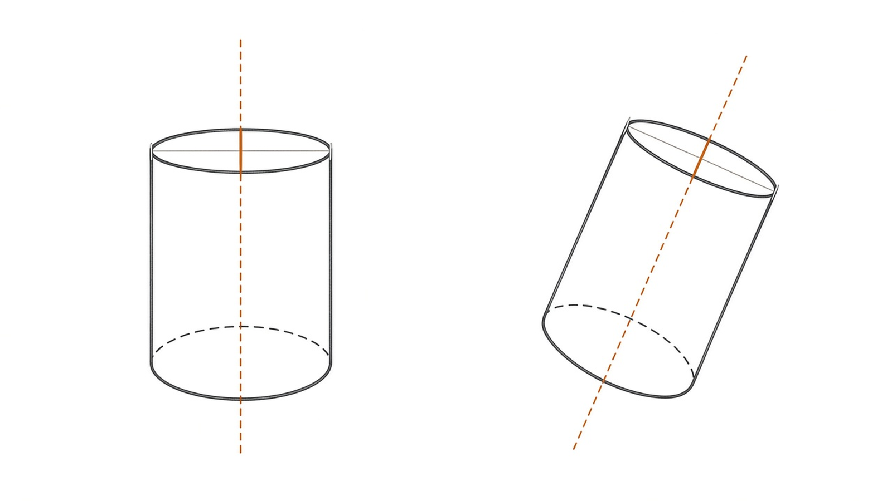

---
layout: drill
minutes: 12
goal: 9 из 12 — ось делит эллипс на две зеркальные половины, линия замкнута, без углов и «лимона»
---

# Эллипс на оси

1. Проведи двенадцать осевых линий разного наклона по всему листу
2. На каждой построй эллипс одним движением от плеча, в два прохода
3. Не подправляй по кусочкам: кривая из отрезков не считается

**Обратная связь:** поверни лист так, чтобы ось встала вертикально, и сравни левую и правую половины эллипса. Они обязаны совпасть.

::reference::

---
layout: default
---

# День 3. Эллипсы раскрываются

Чем дальше круг от уровня глаз, тем полнее эллипс. На самом горизонте он схлопывается в линию. Выше горизонта видно дно, ниже — верх.

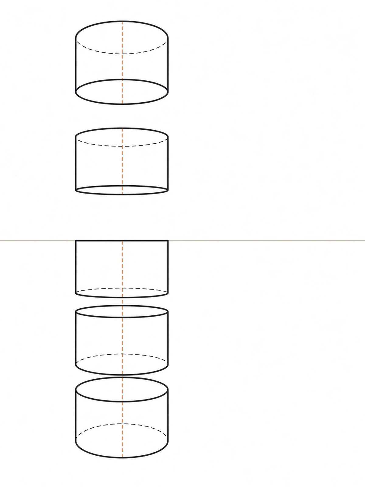

Раскрытие идёт монотонно: эллипс не может внезапно стать у́же, отдаляясь от горизонта.

---
layout: drill
minutes: 12
reps: 2
goal: 2 из 2 листов — эллипсы раскрываются тем сильнее, чем дальше от горизонта, и у всех малая ось лежит на оси
---

# Стопка цилиндров

1. Проведи горизонт на листе заранее
2. Нарисуй кружку с натуры в четырёх положениях по высоте: заметно ниже глаз, чуть ниже, ровно на уровне глаз, выше глаз
3. У каждой проведи ось насквозь

**Обратная связь:** присядь так, чтобы край кружки оказался ровно на уровне глаз. Эллипс схлопнется в линию — сверь с тем, что нарисовал.

::reference::

---
layout: compare
---

# Ошибка: эллипс лежит на боку

Возникает, когда эллипс рисуется как силуэт торца, а не как окружность, надетая на ось.

::wrong::

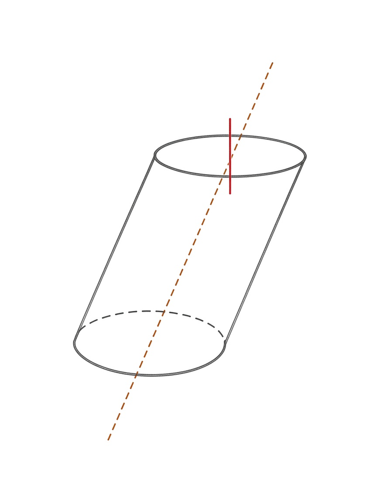

::right::

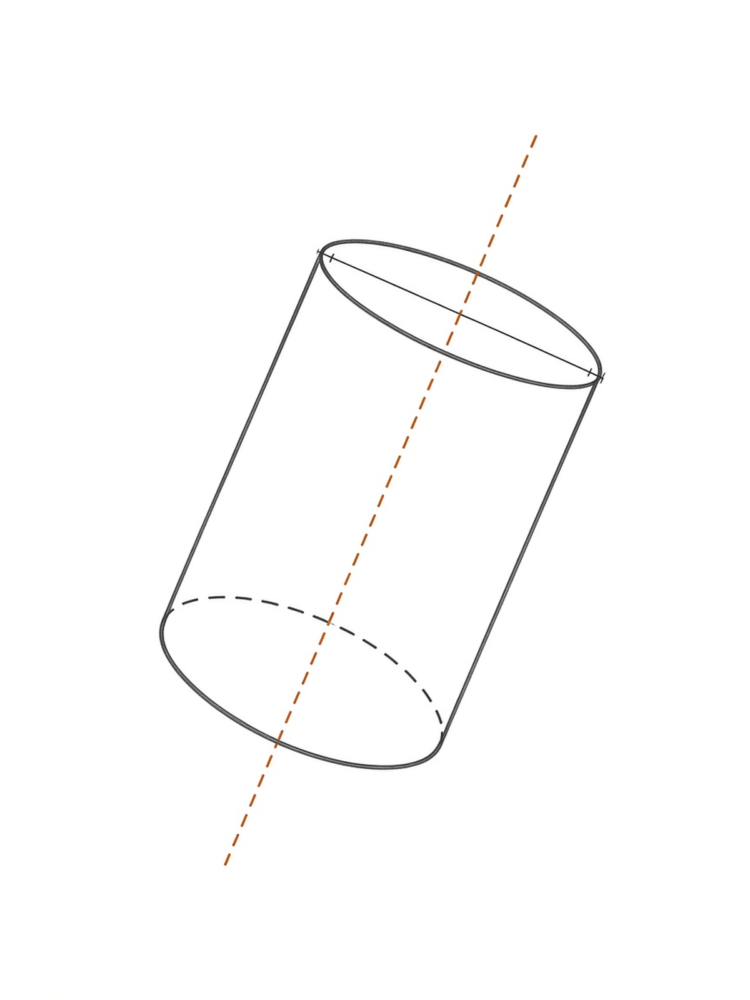

---
layout: default
---

# День 4. Дуга оборачивает форму

Силуэт шара не несёт никакой информации о повороте: круг и круг. Поворот держится только на поперечных дугах.

Дуга — это сечение объёма, а не линия, нарисованная на круге. Проверка простая: дорисуй невидимую половину пунктиром. Не замыкается в ровный эллипс — значит дуга плоская.

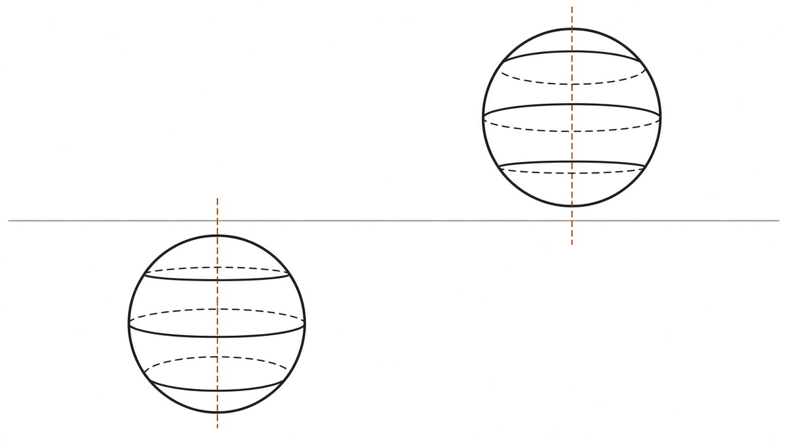

---
layout: drill
minutes: 4
reps: 4
goal: 4 из 4 — ниже горизонта дуги провисают, выше выгибаются вверх, каждая замыкается в эллипс
---

# Дуга, которая оборачивает

1. Проведи горизонт и нарисуй четыре шара: далеко ниже, чуть ниже, на горизонте, выше
2. У каждого проведи ось и три поперечные дуги
3. Невидимую половину каждой дуги дорисуй пунктиром до полного эллипса

**Обратная связь:** если дугу не удаётся замкнуть в ровный эллипс, уходящий за силуэт, ты нарисовал линию на блине, а не сечение шара.

::reference::

---
layout: default
---

# День 4. Яйцо клетки в повороте

Теперь то же самое на грудной клетке из урока 01. Клетка — вытянутый шар, и поворот на ней читается так же: по центральной линии и дугам.

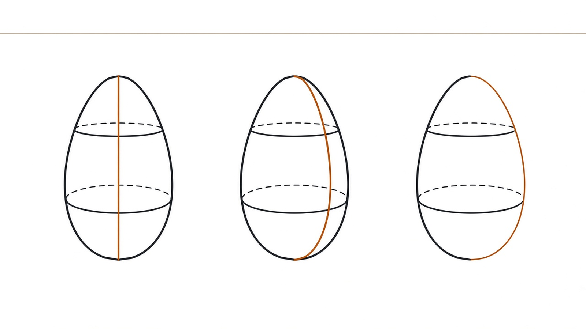

В три четверти центральная линия уходит к дальней стороне, и дальняя половина каждой дуги становится короче ближней. В профиль она ложится прямо на контур.

<!--
В ресерче в одном месте сказано «центральная линия смещена к ближней стороне» —
это противоречит его же критерию «дальняя половина дуги короче». Геометрически
верно второе: схема и текст сделаны по нему.
-->

---
layout: drill
minutes: 6
reps: 3
goal: 3 из 3 — в три четверти дальняя половина каждой дуги короче ближней, и ни одна дуга не вылезает за контур
---

# Яйцо клетки в трёх поворотах

1. Нарисуй вытянутый шар в фас, три четверти и профиль
2. У каждого проведи центральную линию спереди и две поперечные дуги
3. Масштаб и уровень глаз во всех трёх одинаковые

**Обратная связь:** закрой ладонью контур яйца. По центральной линии и дугам должно быть понятно, куда развёрнут объём. Непонятно — дуги нарисованы симметрично.

::reference::

---
layout: compare
---

# Ошибка: плоская дуга

Возникает, когда дуга рисуется как линия на круге, а не как сечение объёма.

::wrong::

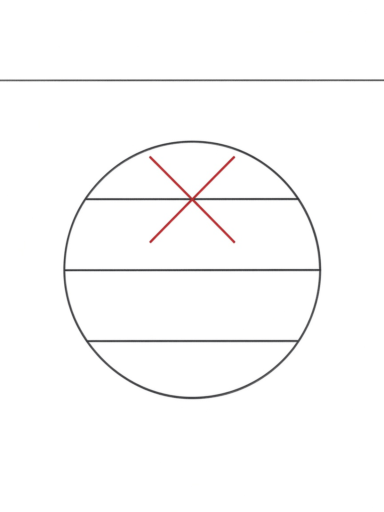

::right::

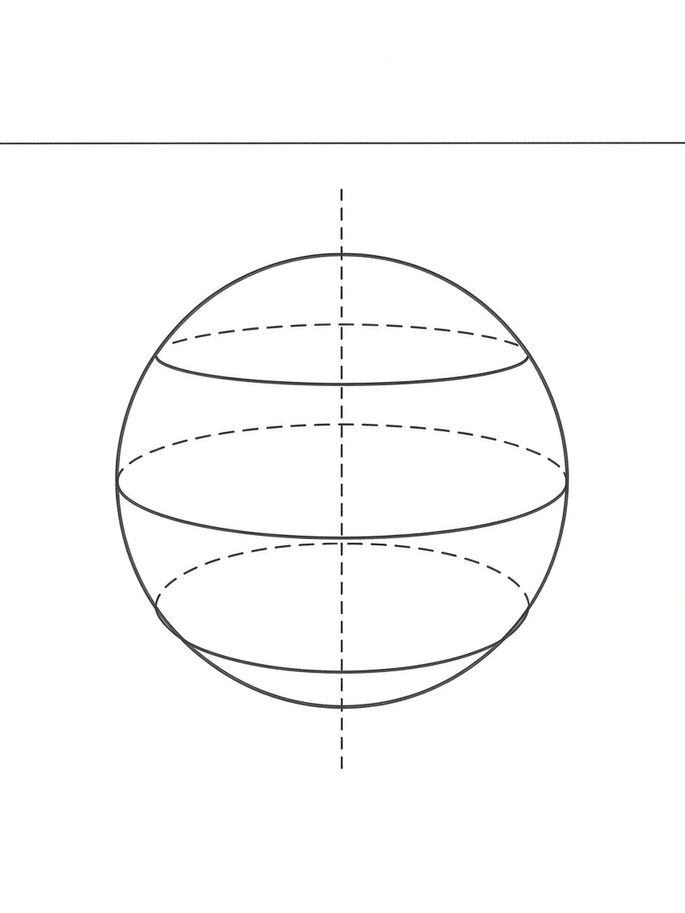

---
layout: default
---

# День 5. Сборка торса

Клетка и таз строятся не по отдельности «как красиво», а на одной линии горизонта, проведённой на лист до всего остального. Тогда рёбра таза и дуги клетки согласуются сами, без подгонки на глаз.

Порядок: горизонт → оси клетки и таза → коробка таза по двум точкам → яйцо клетки с дугами → шея-цилиндр. От общего к частному, без перескоков: начнёшь с объёмов — получишь две детали на разных горизонтах.

<Tip source="Эндрю Лумис, «Successful Drawing»">
В коробку можно вписать что угодно. Чувствуй перспективное отношение фигуры так, как если бы она стояла внутри блока.
</Tip>

---
layout: drill
minutes: 8
reps: 3
goal: 3 из 3 — рёбра таза сходятся на проведённом горизонте, дуги клетки и видимая грань таза смотрят в одну сторону
---

# Торс из двух объёмов

1. Проведи горизонт на весь лист
2. Наметь оси клетки и таза с разным наклоном
3. Построй коробку таза по двум точкам, скрытые рёбра пунктиром
4. Построй яйцо клетки с центральной линией и дугами
5. Добавь шею-цилиндр

**Обратная связь:** продли верхние и нижние рёбра коробки таза — они обязаны сойтись на том самом горизонте, который ты провёл первым. Видна верхняя грань таза — дуги клетки обязаны провисать вниз.

::reference::

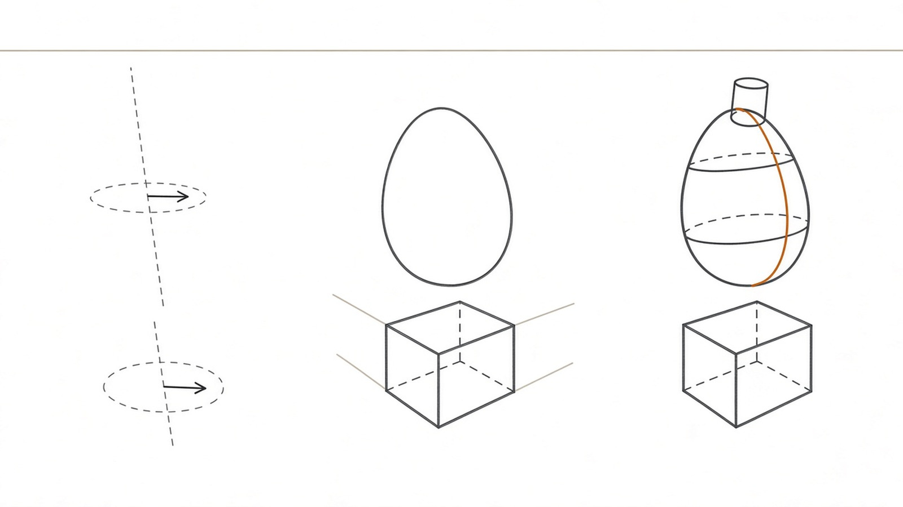

---
layout: drill
minutes: 8
reps: 2
goal: 2 из 2 — на рисунке видны ровно те же грани коробка, что и на столе
---

# Сверка с предметом

1. Поставь на стол спичечный коробок как таз и яйцо или мячик как клетку
2. Разверни их так же, как на рисунке из прошлого дрилла
3. Сядь так, чтобы уровень глаз совпал с горизонтом рисунка
4. Нарисуй с натуры

**Обратная связь:** сравни, какие грани коробка видны на столе и какие на твоём рисунке. Несовпадение означает, что ты сочинял схему, а не строил вид.

::reference::

---
layout: default
---

# Разбор: порядок сборки

Порядок не переставляется. Первая стадия выглядит пустой, и её хочется пропустить — ровно она и держит оба объёма на одном горизонте. Начнёшь со второй, и никакие дуги этого потом не исправят.

<!--
Самая частая просьба — «давай сразу объёмы». Ровно здесь и ломается результат.
-->

---
layout: checkpoint
---

# Чек-лист урока

- Вертикали параллельны краю листа — проверено приложенным краем
- Продление рёбер коробки даёт точки на одном и том же горизонте
- У каждого эллипса малая ось лежит на оси своего цилиндра
- Ниже горизонта нет ни одной дуги, выгнутой вверх
- У каждого объёма дальняя сторона у́же ближней
- Коробок и яйцо со стола показывают те же грани, что и рисунок

::fallback::

Несошедшийся пункт — это конкретный день: горизонт и точки схода — день 1, коробка и диагонали — день 2, эллипсы — день 3, дуги — день 4, сборка — день 5. Повтори день целиком.

---
layout: default
---

# Практика дальше

- **10 минут в день** — одна коробка и один цилиндр с натуры на одном горизонте
- Перед каждым рисунком фигуры проводи горизонт первым, даже если фигура стоит в пустоте
- Раз в неделю возвращайся к дриллу «Сверка с предметом»: он единственный, где натура прямо говорит, где ты соврал

<Tip source="Роберт Грин, «Мастерство»">
Иди туда, где не получается. Скучный дрилл с коробками — ровно тот случай: он не даёт красивой картинки, но без него ракурс останется угадыванием.
</Tip>

---
layout: default
---

# Схемы и источники

Схемы урока нарисованы для него же, лежат в `images/diagrams/`, рядом с каждой — описание рисунка и промпт для отрисовки.

Материал урока опирается на учебники в открытом доступе:

- **Andrew Loomis**, «Successful Drawing» и «Figure Drawing for All It's Worth» — круг в перспективе строится внутри перспективного квадрата, эллипсы сужаются у горизонта
- **Ernest R. Norling**, «Perspective Made Easy» (1939) — горизонт есть уровень глаз, ось цилиндра и большая ось эллипса образуют «T»
- **James Gurney**, заметки о перспективе колёс и окружностей — правило осей эллипса
- **handprint.com**, раздел о перспективе — точки схода, конус зрения, диагонали

Ссылки на конкретные страницы и сканы — в `research.md` рядом с уроком.
