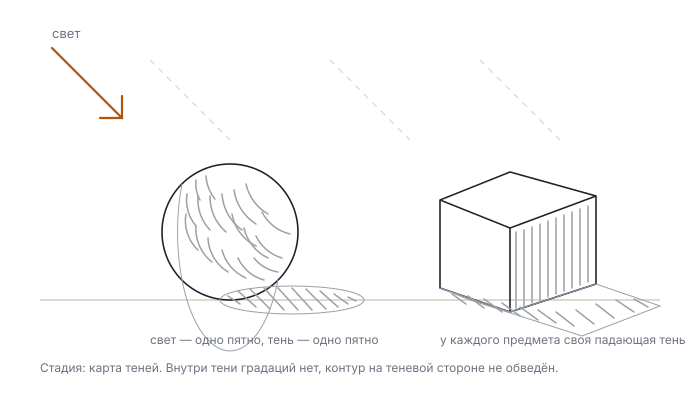
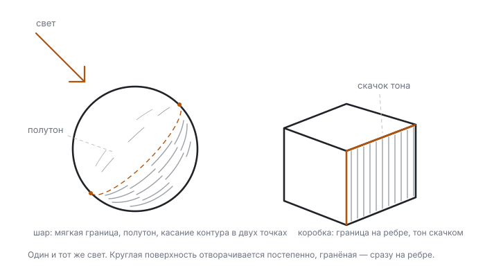
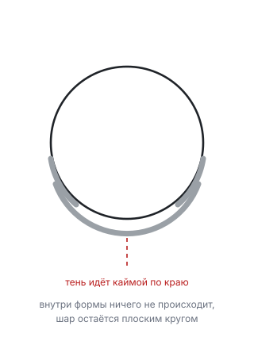
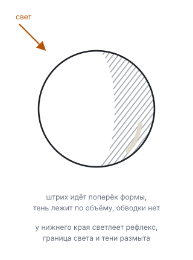
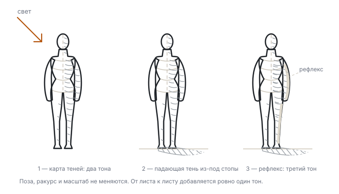
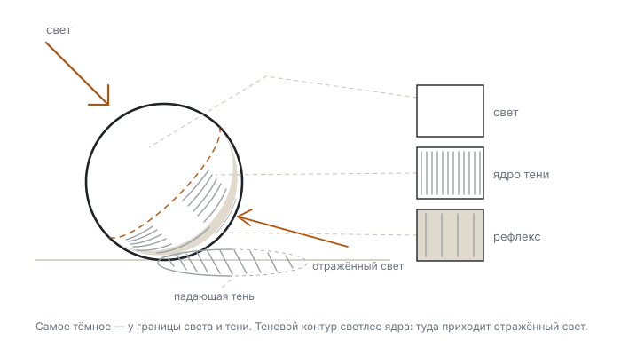
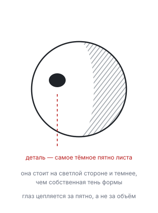
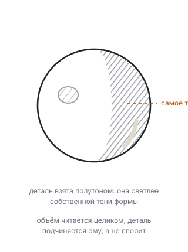

# Свет и тон на фигуре

Четыре дня по 45 минут. Один источник света, три тона, и построение наконец превращается в объём.

<!--
Урок опирается на 03: границы света и тени ставятся на построенной форме, а не на силуэте.
-->

---
layout: default
---

# Как этим пользоваться

- **Материалы:** карандаш, пачка А4, таймер.
- **Натура:** настольная лампа, теннисный мяч и коробка, обёрнутые белой бумагой. Белое нужно, чтобы не мешал собственный цвет предмета.
- **Один источник.** Верхний свет в комнате выключи. Два источника дают две тени и ломают всю задачу.
- **Стрелка первой.** В углу листа рисуй стрелку направления луча до первого штриха.
- **Тон не растушёвывается пальцем.** Штрих кладётся по форме и остаётся видимым.

<Tip source="Джош Кауфман, «Первые 20 часов»">
Убери барьеры. Лампа и два белых предмета стоят на столе всю неделю: садишься и рисуешь, а не собираешь постановку заново.
</Tip>

---
layout: default
---

# Зачем этот урок

- **Результат:** кладёшь тон от одного источника ровно тремя тонами так, что с трёх шагов рисунок читается двумя пятнами
- **Проверяется так:** прищурься. Осталось два пятна — объём есть. Рассыпалось на пять — тонов больше трёх
- **Нужно для:** любого законченного рисунка фигуры; без тона построение остаётся чертежом

Главное недоразумение новичка: тон кладётся вдоль контура, потому что контур — единственное, что он построил. На деле граница света и тени живёт внутри формы.

---
layout: default
---

# Из чего состоит задача

1. **Направление света** — решается до первого штриха и не меняется
2. **Две семьи тонов** — всё либо на свету, либо в тени, третьего нет
3. **Граница по форме** — на шаре мягкая и круглая, на коробке резкая и по ребру
4. **Падающая тень** — своя граница, своя плотность, начинается от точки контакта
5. **Три тона** — свет, тень, рефлекс, и ни одного больше

<Tip source="Джош Кауфман, «Первые 20 часов»">
Тренируй подшаг, который даёт больше всего результата. Здесь это карта теней: пока рисунок не делится на два пятна, никакая детализация не поможет.
</Tip>

---
layout: default
---

# День 1. Свет решается первым

Направление луча — это решение, а не наблюдение по ходу дела. Поставил лампу, нарисовал стрелку в углу листа, дальше каждый штрих ей подчиняется.

Дальше лист делится на две семьи: то, куда луч попадает, и то, куда не попадает. Между ними ничего.

---
layout: drill
minutes: 5
reps: 5
goal: на 4 листах из 5 ровно два тона, и сторона тени совпадает со стрелкой в углу
---

# Карта теней

1. Поставь лампу слева-сверху, второй свет выключи
2. Нарисуй стрелку направления луча в углу листа
3. Залей одним ровным тоном всё, что не получает прямого луча
4. Ровно два тона, между ними ничего. Контур на теневой стороне не обводи
5. Пять предметов подряд: шар, коробка, цилиндр, фигура в фас, фигура в три четверти

**Обратная связь:** прищурься так, чтобы лист едва просвечивал между ресницами. Должно остаться ровно два пятна. Три пятна или мохнатая граница означают, что тон клался от края внутрь.

---
layout: default
---

# День 2. Граница живёт на форме

Где именно свет уходит с формы, решает сама форма, а не силуэт.

На шаре граница — эллипс, идущий по поверхности, и она мягкая: свет уходит через полутон. На коробке граница совпадает с ребром и даёт скачок тона без всякого перехода.

---
layout: drill
minutes: 5
reps: 4
goal: на шаре граница касается контура ровно в двух точках, на коробке целиком лежит на рёбрах
---

# Граница по форме

1. Поставь под одну лампу шар и коробку
2. На шаре проведи границу света и тени как эллипс по поверхности
3. На коробке — строго по рёбрам
4. Пятый лист: фигура. Найди, где грудная клетка даёт скат, а гребень таза и лопатка дают ребро

**Обратная связь:** закрой ладонью контур рисунка. Если форма читается по одной только границе света и тени — граница стоит на месте. Рассыпается — ты срисовал её с силуэта.

::reference::

---
layout: compare
---

# Ошибка: тон вдоль контура

Возникает, когда контур — единственное, что построено, и тон кладётся от края внутрь.

::wrong::

::right::

---
layout: default
---

# День 3. Падающая тень

Собственная тень принадлежит форме, падающая — плоскости под ней. У них разные границы и разная плотность.

Падающая тень начинается от точки контакта без просвета. У основания её край резкий, к дальнему концу размывается.

---
layout: drill
minutes: 4
reps: 4
goal: во всех подходах тень выходит из точки контакта без просвета, край у основания резкий, на дальнем конце размытый
---

# Падающая тень

1. Поставь предмет на лист бумаги под лампу
2. Нарисуй тень от него в четырёх положениях лампы: сбоку, выше, ниже, почти сзади
3. Плотность тени — не светлее самой тёмной части собственной тени
4. Два листа по 10 минут: то же самое на фигуре, тень от опорной стопы

**Обратная связь:** прикрой ладонью падающую тень. Предмет должен повиснуть в воздухе. Убери ладонь — сесть на плоскость. Ничего не изменилось — тень слишком светлая или оторвана от точки контакта.

---
layout: default
---

# День 4. Три тона и ни одного больше

Свет, тень, рефлекс. Самое тёмное место — не контур и не деталь, а участок собственной тени у самой границы света и тени. Рефлекс живёт между этим ядром и теневым краем, и он всегда темнее любого места на свету.

---
layout: drill
minutes: 20
reps: 2
goal: ровно три различимых тона, самый тёмный участок примыкает к границе света и тени, рефлекс темнее любого места на свету
---

# Три тона, сборка

1. Пять минут: лёгкое построение линиями из уроков 01–03
2. Пятнадцать минут: тон в три градации и ни одной больше
3. Первый лист — фигура в фас, второй — в три четверти

**Обратная связь:** на десятой минуте отойди на три шага и прищурься. Рисунок должен читаться двумя пятнами. Распался на три и больше — тонов больше трёх. Деталь выскакивает из тени — спроси себя: в общем впечатлении она относится к свету или к тени? Третьего не дано.

::reference::

---
layout: compare
---

# Ошибка: деталь темнее тени

Возникает, когда рисуется локальный цвет детали, а не её место в раскладке тонов.

::wrong::

::right::

---
layout: checkpoint
---

# Чек-лист урока

- В углу листа стоит стрелка направления луча, и тень с ней совпадает
- На рисунке ровно три тона, а не пять
- Граница света и тени на шаре мягкая, на коробке совпадает с ребром
- Самое тёмное место примыкает к границе света и тени, а не к контуру
- Падающая тень выходит из точки контакта без просвета
- Ни одна деталь не темнее собственной тени формы
- С трёх шагов и прищуром рисунок читается двумя пятнами

::fallback::

Несошедшийся пункт — это конкретный день: две семьи тонов — день 1, граница по форме — день 2, падающая тень — день 3, три тона — день 4.

---
layout: default
---

# Практика дальше

- **15 минут в день** — один предмет под лампой, только карта теней в два тона
- Раз в неделю — фигура целиком в три тона по таймеру, 20 минут
- Перед каждым рисунком рисуй стрелку света. Привычка решать свет заранее стоит дороже любой техники штриха

<Tip source="Роберт Грин, «Мастерство»">
Работай на сопротивлении. Прищур честно показывает, что рисунок распался на пятна — и именно в этот момент хочется вернуться к приятной детализации вместо того, чтобы чинить тон.
</Tip>

---
layout: default
---

# Схемы и источники

Схемы урока нарисованы для него же, лежат в `images/diagrams/`, рядом с каждой — описание рисунка и промпт для отрисовки.

Это первый урок курса, где методика опирается не на общеизвестные положения, а на учебники с проверяемыми страницами. Обе книги в public domain:

- **Anson K. Cross**, «Light and Shade» (1897) — преподаватель Massachusetts Normal Art School. Две семьи тонов, граница на кривой и гранёной поверхности, петля прищура, место детали в раскладке
- **Harold Speed**, «The Practice and Science of Drawing» (1913) — главы VIII и IX: почему теневой контур светлее ядра тени

Точные страницы и ссылки на сканы — в `research.md` рядом с уроком.
