# Руки и кисти

Пять дней по 45–50 минут. Натура всегда с тобой: вторая рука. Зеркало не нужно.

<!--
Долг курса: в уроке 01 руки явно вынесены за рамки недели. Урок опирается на коробку в ракурсе из урока 03.
-->

---
layout: default
---

# Как этим пользоваться

Единственная тема курса, где натура никогда не заканчивается: свободная кисть лежит перед тобой в любой позе, какую попросишь.

- **Материалы:** карандаш, пачка А4, таймер. Зеркало не нужно.
- **Натура:** твоя вторая кисть. Клади её на стол, поворачивай, сгибай, смотри с ребра.
- **Порядок:** жест, коробка ладони, клин большого, веер пальцев. Пальцы последними всегда.
- **Чего в уроке нет:** ногтей, складок, вен, кулака и хвата предмета. Они не мешают кисти читаться и тянут на отдельную неделю.

<Tip source="Джош Кауфман, «Первые 20 часов»">
Убери барьеры перед практикой. Здесь их нет вообще: натура, карандаш и лист — всё, что нужно, уже на столе.
</Tip>

---
layout: default
---

# Зачем этот урок

- **Результат:** строишь кисть в трёх положениях так, что пропорции ладони и пальцев, веер и посадка большого читаются без единой складки
- **Проверяется так:** закрой пальцы ладонью. По одной коробке и клину должно быть понятно, какое это положение
- **Нужно для:** фигуры целиком. Кисти держат позу не меньше корпуса, и именно они выдают новичка

Кисть кажется сложной, потому что её рисуют как пять сосисок на лепёшке. На деле это одна коробка, один клин и три дуги.

---
layout: default
---

# Из чего состоит задача

1. **Пропорции руки** — где на фигуре стоят локоть, запястье и кончики пальцев
2. **Коробка ладони** — у ладони есть толщина, верх, низ и торцы
3. **Клин большого** — он растёт от запястья и работает в своей плоскости
4. **Веер пальцев** — суставы лежат на дугах, а не на прямых
5. **Жест и ракурс** — сначала одна длинная ось, потом всё остальное

<Tip source="Джош Кауфман, «Первые 20 часов»">
Разбери навык на части. Первые две части дают больше половины сходства: кисть с верной коробкой читается даже без пальцев.
</Tip>

---
layout: default
---

# День 1. Где рука стоит на фигуре

Три отметки на фигуре в 7,5 голов из урока 01: локоть чуть выше пупка, запястье на уровне лобковой кости, кончики пальцев чуть ниже середины бедра.

Мерка, которая всегда под рукой: ладонь закрывает лицо от подбородка до корней волос. Кисть по длине равна лицу.

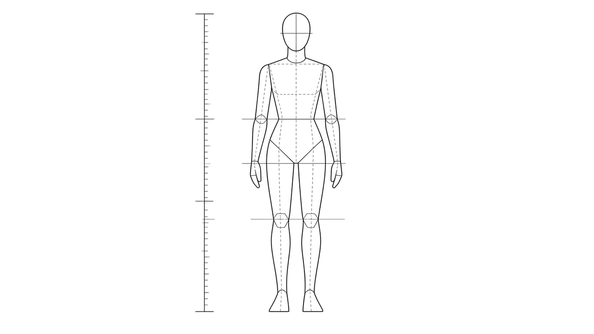

---
layout: drill
minutes: 8
reps: 4
goal: на 3 листах из 4 мерка лица укладывается в длину кисти ровно один раз, запястье на уровне лобковой кости
---

# Три отметки и варежка

1. Нарисуй фигуру в 7,5 голов, как в уроке 01
2. Отметь локоть, запястье и кончики пальцев
3. Посади кисть одной массой-варежкой: коробка ладони плюс общая масса пальцев
4. Пальцы не разделяй — сегодня их нет

**Обратная связь:** приложи свою ладонь к своему лицу — она закрывает от подбородка до корней волос. Сними эту мерку карандашом с лица нарисованной фигуры и померь ею нарисованную кисть.

::reference::

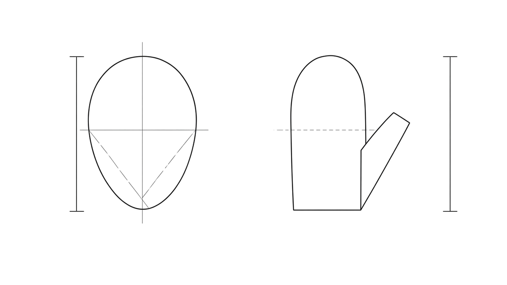

---
layout: default
---

# День 2. У ладони есть толщина

Ладонь — не лепёшка, а коробка. У неё есть тыл, ладонная сторона и торцы, и с ребра она никуда не исчезает. Тыл почти плоский, ладонь ложится чашей.

Ступенька запястья: запястье у́же ладони, и переход между ними виден.

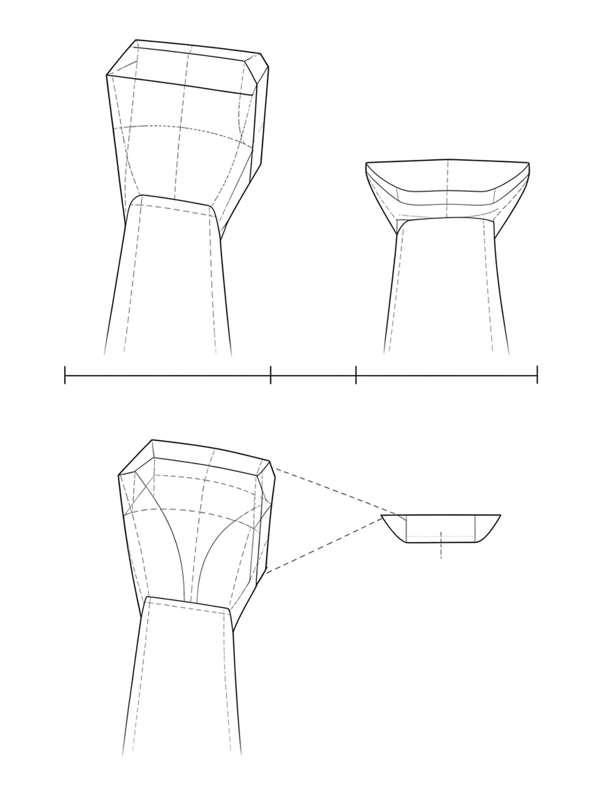

---
layout: drill
minutes: 8
reps: 4
goal: у всех трёх коробок виден торец, толщина запястья с ребра вдвое меньше его ширины с тыла
---

# Коробка ладони: тыл, ребро, ладонь

1. Один лист, три вида одной кисти без пальцев
2. Тыльная сторона, вид с ребра со стороны мизинца, ладонь
3. У каждой коробки прорисуй торец и ступеньку запястья
4. Пальцы обозначь обрубками в один сустав

**Обратная связь:** поверни свою кисть в те же три положения и посмотри с ребра. Толщина никуда не девается.

::reference::

---
layout: compare
---

# Ошибка: плоская ладонь

Возникает, когда ладонь рисуется силуэтом, без торцов и без толщины.

::wrong::

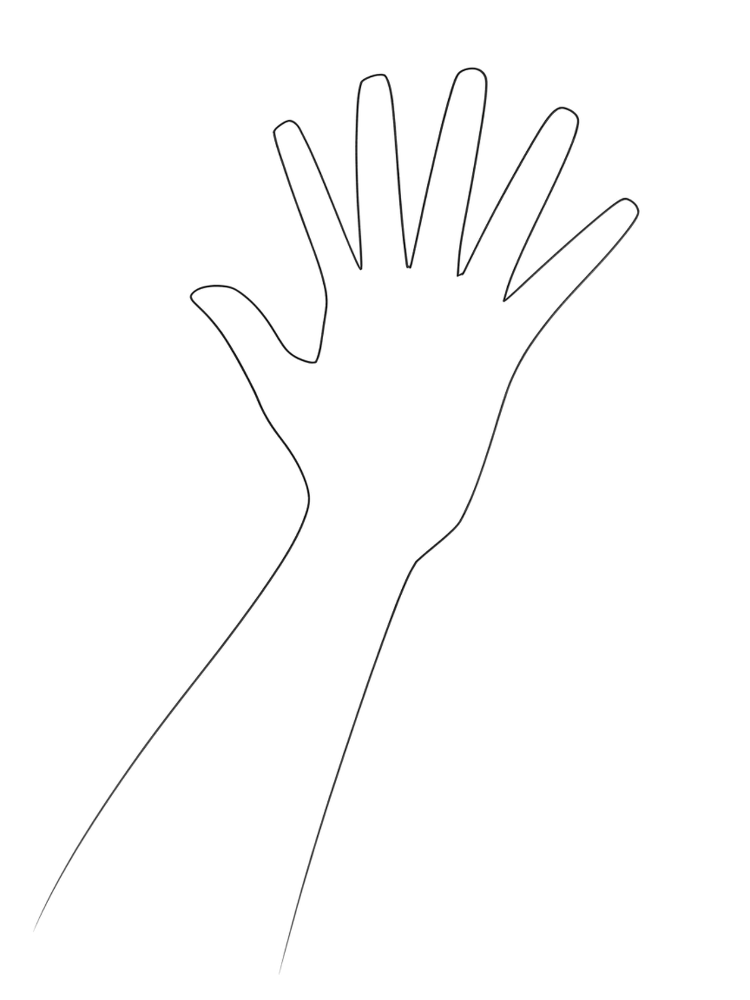

::right::

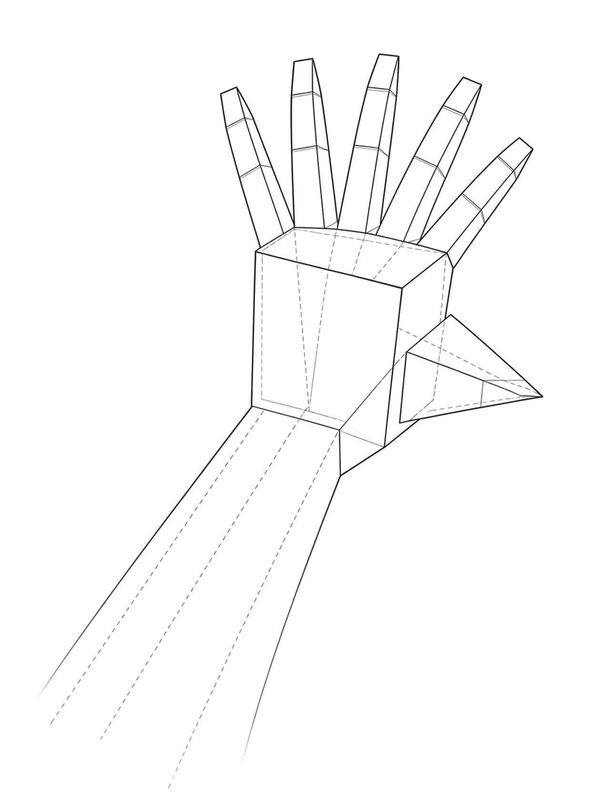

---
layout: default
---

# День 3. Большой палец растёт от запястья

Большой палец начинается не от костяшки указательного, а у запястья, сбоку и ниже, чем кажется. Он работает в своей плоскости: положи кисть тылом на стол — большой не ложится плашмя, он стоит.

Кончик доходит до среднего сустава указательного, не дальше.

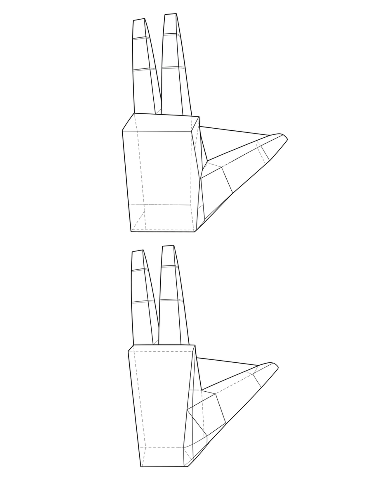

---
layout: drill
minutes: 8
reps: 4
goal: основание большого начинается у запястья, кончик не заходит за средний сустав указательного
---

# Клин большого пальца

1. Возьми готовую коробку ладони
2. Посади большой палец: основание от запястья, масса пирамидой
3. Три положения: прижат, отведён, выведен вперёд

**Обратная связь:** положи свою кисть ладонью на стол. Тыл лежит, большой не ложится плашмя. Посмотри на ту же кисть с торца, со стороны мизинца.

::reference::

---
layout: compare
---

# Ошибка: большой приклеен спереди

Возникает, когда большой палец рисуется как пятый такой же палец, только короче.

::wrong::

::right::

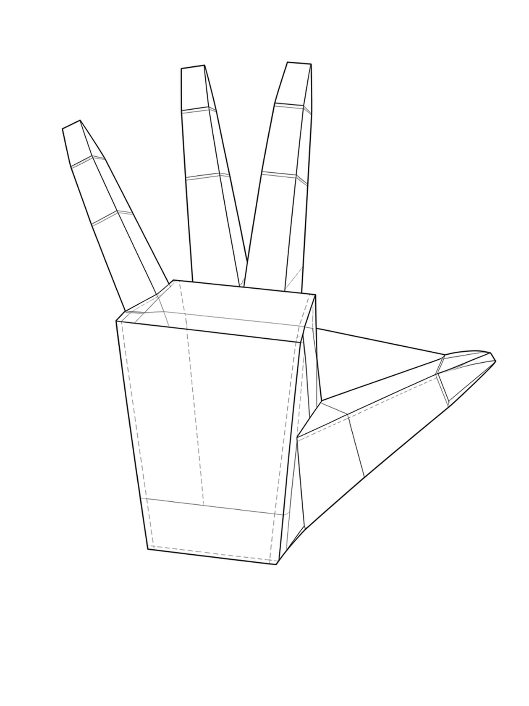

---
layout: default
---

# День 4. Суставы лежат на дугах

Костяшки, средние суставы и кончики образуют три дуги, а не три прямые. Центр дуг — у основания большого пальца, вершина дуги костяшек приходится на средний палец.

Первая фаланга каждого пальца равна двум остальным вместе. Сами пальцы при этом разной длины: средний самый длинный, поэтому вершина каждой дуги приходится именно на него. На схеме дуги показаны концентрическими, чтобы читалось главное — они дуги, а не прямые; разницу длин проверяй на своей руке.

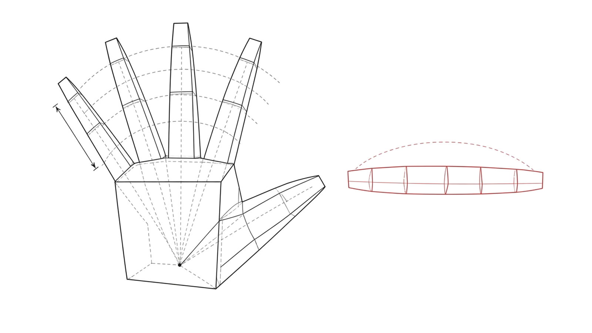

---
layout: drill
minutes: 8
reps: 4
goal: все три линии — дуги, а не прямые, и вершина каждой приходится на средний палец
---

# Три дуги и веер

1. На коробке ладони проведи три дуги: через костяшки, через средние суставы, через кончики
2. Центр дуг — у основания большого, вершина дуги костяшек у среднего пальца
3. Разведи пальцы веером из общего центра
4. Отметь деление: первая фаланга равна двум остальным

**Обратная связь:** согни пальцы своей кисти — кончики смотрят в одну точку у основания большого. На своём листе соедини одноимённые суставы одной линией.

::reference::

---
layout: compare
---

# Ошибка: пальцы-сосиски

Возникает, когда пальцы рисуются одинаковыми трубками одной длины, а суставы выстраиваются по прямой.

::wrong::

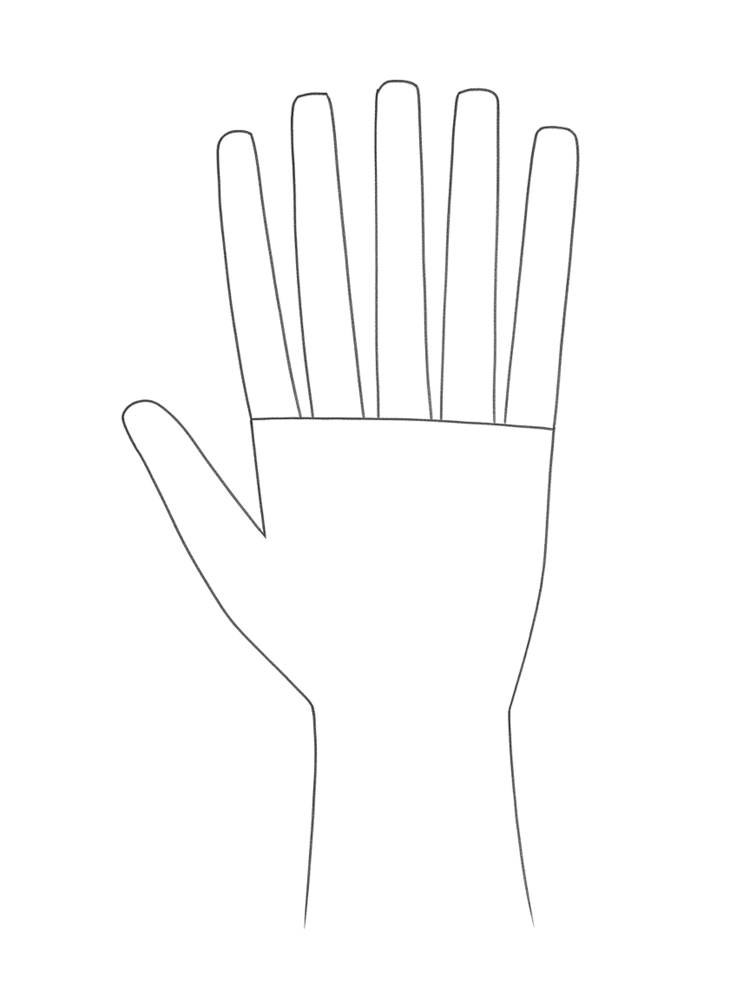

::right::

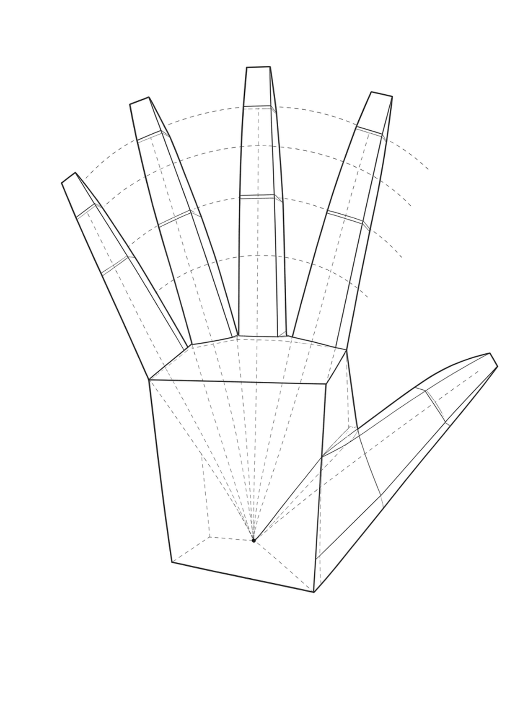

---
layout: default
---

# Ладонь короче, чем кажется

С ладонной стороны пальцы выглядят короче, чем с тыла, и это не ошибка наблюдения. Подушка ладони заходит до середины первой фаланги, и видимая часть пальца укорачивается.

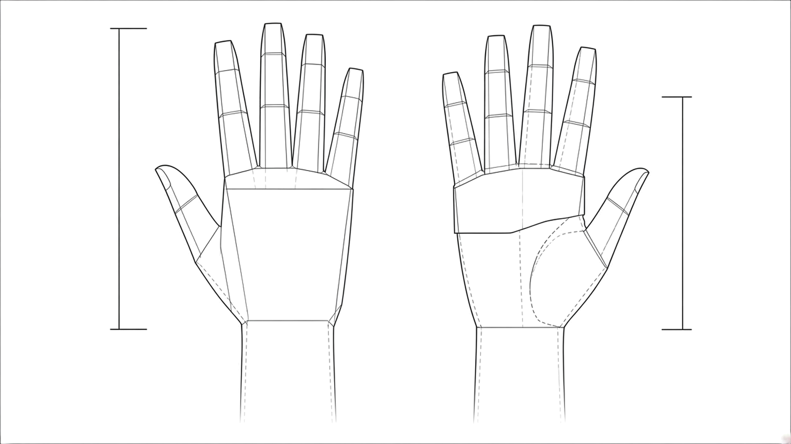

Рисуя ладонь, не тяни пальцы до той же длины, что на тыльной стороне: получится лапа.

---
layout: default
---

# День 5. Жест, коробка, пальцы

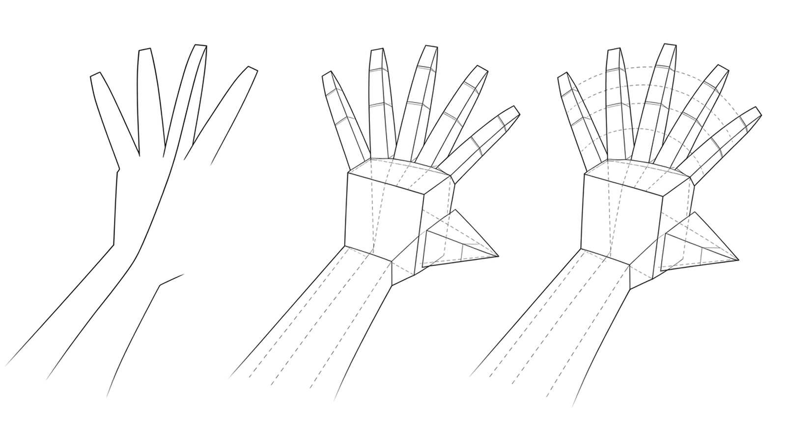

Одна длинная ось идёт от предплечья через ладонь к среднему пальцу. Она ставится первой и держит всё остальное. В ракурсе сегменты пальцев не выстраиваются встык: между ними видна ступенька.

---
layout: drill
minutes: 30
unit: сек
reps: 6
goal: ось проходит от предплечья до кончика среднего пальца одним движением
---

# Жест кисти

1. Поставь таймер на 30 секунд
2. Одна длинная ось от предплечья через ладонь к среднему пальцу
3. Никакой формы, только направление
4. Шесть подходов подряд, меняя положение своей кисти

**Обратная связь:** если ось получается из двух кусков со сломом в запястье, ты рисуешь две отдельные вещи вместо одного движения.

::reference::

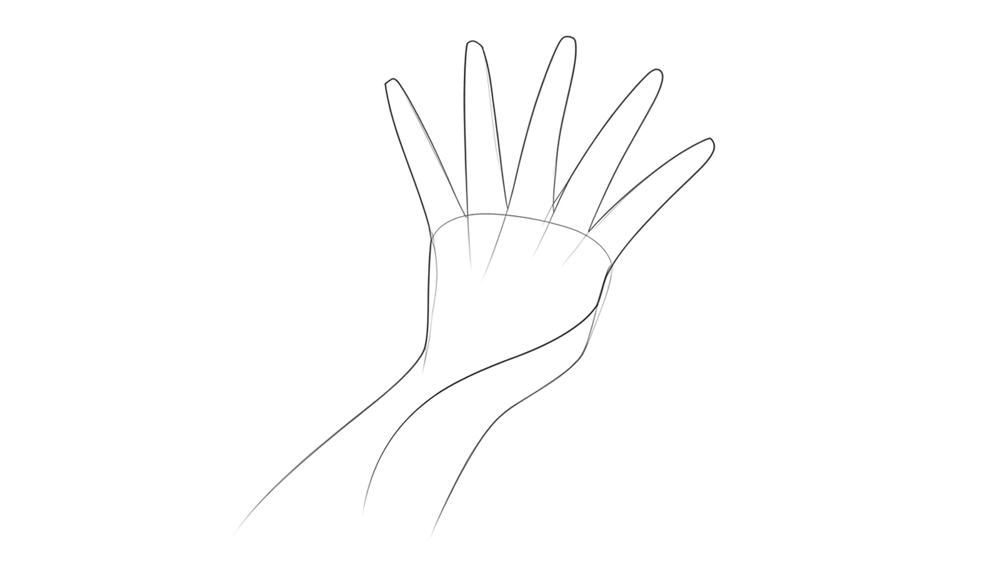

---
layout: drill
minutes: 10
reps: 3
goal: три листа за 30 минут, ладонь и пальцы равны по длине, костяшки на дуге, большой начинается у запястья
---

# Сборка: три положения

1. **30 секунд** — жест одной осью
2. **3 минуты** — коробка ладони и клин большого
3. **Остальное** — веер пальцев и уточнение
4. Три листа: тыльная сторона, ладонь, кисть в ракурсе с пальцами на себя

**Обратная связь:** закрой пальцы ладонью. По одной коробке и клину должно быть понятно, какое это положение. В ракурсном листе проверь, что между сегментами пальцев видна ступенька, а не стык.

::reference::

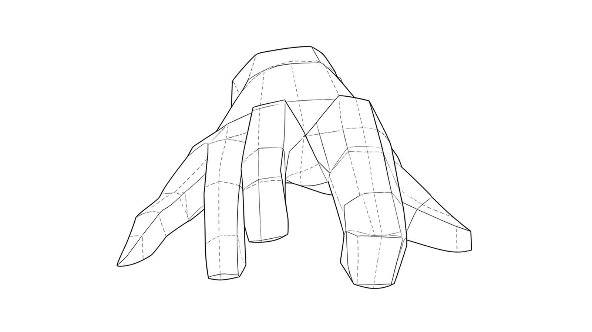

---
layout: checkpoint
---

# Чек-лист урока

- Кисть по длине равна лицу фигуры
- Запястье стоит на уровне лобковой кости
- У ладони виден торец, с ребра толщина не исчезает
- Большой палец начинается у запястья и стоит в своей плоскости
- Костяшки лежат на дуге, а не на прямой
- Ни один палец не равен соседнему по длине
- В ракурсе между сегментами пальцев видна ступенька

::fallback::

Несошедшийся пункт — это конкретный день: пропорции — день 1, коробка — день 2, большой — день 3, дуги — день 4, ракурс — день 5.

---
layout: default
---

# Практика дальше

- **10 минут в день** — своя вторая кисть в одном новом положении, по четырём шагам
- В каждом рисунке фигуры доводи кисти хотя бы до варежки: коробка плюс общая масса пальцев
- Отдельная неделя ждёт: кулак, хват предмета, складки и тон на кисти

<Tip source="Роберт Грин, «Мастерство»">
Иди туда, где не получается. Кисти — то место, которое новичок прячет за спину модели. Именно поэтому их стоит рисовать первыми.
</Tip>

---
layout: default
---

# Схемы и источники

Схемы урока нарисованы для него же, лежат в `images/diagrams/`, рядом с каждой — описание рисунка и промпт для отрисовки.

Материал опирается на учебники в public domain:

- **George Bridgman**, «Constructive Anatomy» (1920) — коробка ладони, пропорция запястья, веер пальцев, ступенька сегментов в ракурсе
- **John Vanderpoel**, «The Human Figure» (1911) — массы кисти
- **Arthur Thomson**, «A Handbook of Anatomy for Art Students» (1899) — пропорции руки, таблица Рише
- **Витрувий**, книга III, глава 1 — кисть равна лицу

Одна оговорка честности: связка «локоть примерно на уровне талии» прямой цитатой не подтверждается, она выведена из таблицы Рише у Томсона. В ресерче это помечено отдельно.
